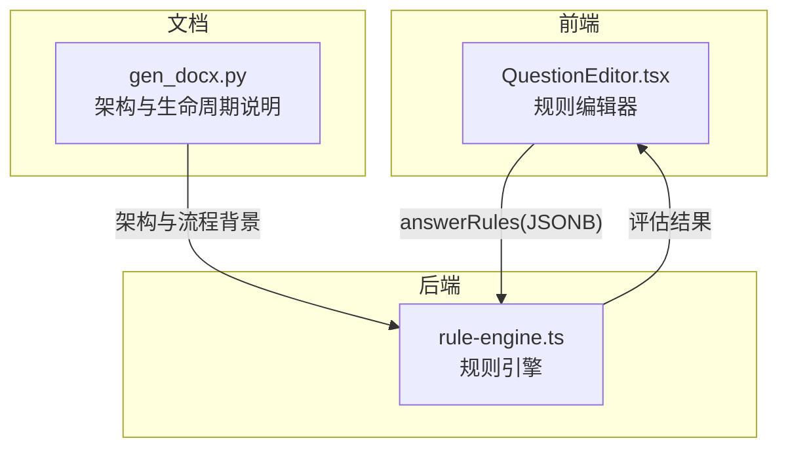
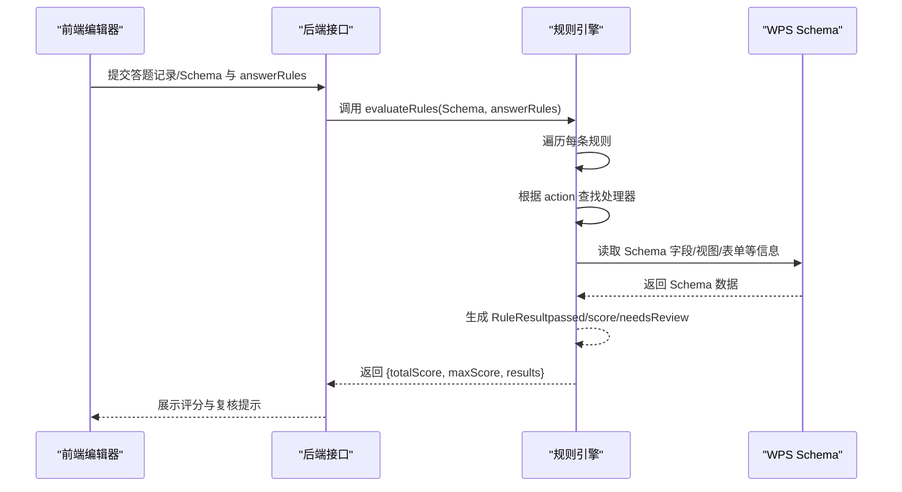
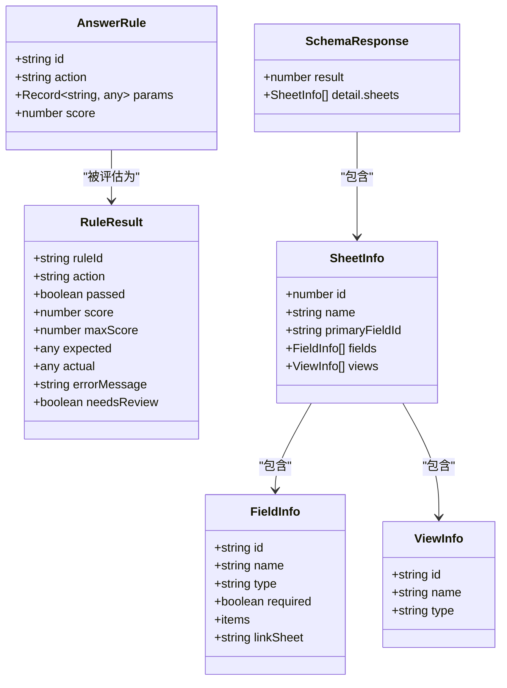
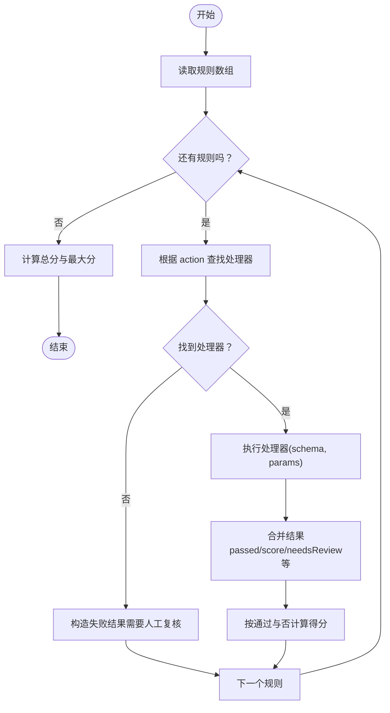
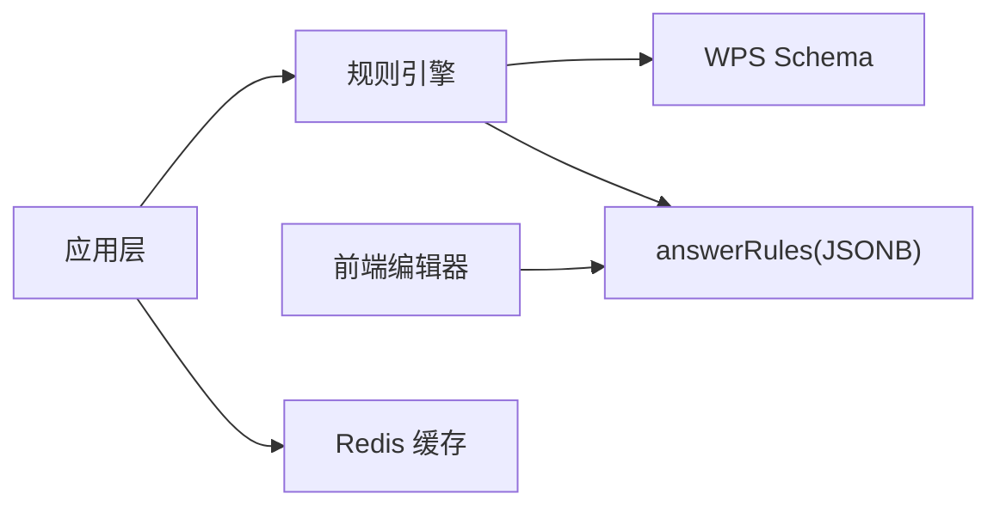

# 规则引擎

<cite>
**本文引用的文件**
- [packages/server/src/engine/rule-engine.ts](file://packages/server/src/engine/rule-engine.ts)
- [packages/client/src/pages/teacher/QuestionEditor.tsx](file://packages/client/src/pages/teacher/QuestionEditor.tsx)
- [gen_docx.py](file://gen_docx.py)
</cite>

## 目录
1. [引言](#引言)
2. [项目结构](#项目结构)
3. [核心组件](#核心组件)
4. [架构总览](#架构总览)
5. [详细组件分析](#详细组件分析)
6. [依赖分析](#依赖分析)
7. [性能考虑](#性能考虑)
8. [故障排查指南](#故障排查指南)
9. [结论](#结论)
10. [附录](#附录)

## 引言
本文件面向开发者与维护者，系统性阐述该考试系统中的“规则引擎”实现与使用方法。内容涵盖规则语法与数据模型、解析与执行流程、缓存与性能优化、错误处理与调试、以及扩展与自定义规则的开发指南。本文严格基于仓库中现有源码与文档生成，避免臆测。

## 项目结构
- 后端规则引擎位于 packages/server/src/engine/rule-engine.ts，包含规则类型定义、规则处理器映射、单规则评估与批量评估等核心逻辑。
- 前端教师端编辑器用于构建与编辑规则，规则参数随 action 动态提示，便于可视化配置。
- 文档生成脚本 gen_docx.py 中包含关于“验证引擎”的架构说明与考试生命周期流程，可作为整体背景参考。

图表来源
- [packages/server/src/engine/rule-engine.ts](file://packages/server/src/engine/rule-engine.ts)
- [packages/client/src/pages/teacher/QuestionEditor.tsx](file://packages/client/src/pages/teacher/QuestionEditor.tsx)
- [gen_docx.py](file://gen_docx.py)

章节来源
- [packages/server/src/engine/rule-engine.ts](file://packages/server/src/engine/rule-engine.ts)
- [packages/client/src/pages/teacher/QuestionEditor.tsx](file://packages/client/src/pages/teacher/QuestionEditor.tsx)
- [gen_docx.py](file://gen_docx.py)

## 核心组件
- 规则类型与结果模型
  - AnswerRule：规则标识、动作类型、参数对象、满分分值。
  - RuleResult：单条规则的判定结果，包含是否通过、得分、最大分、期望值、实际值、错误信息、是否需要人工复核等。
- 规则处理器映射
  - ruleHandlers：根据 rule.action 分发到具体校验函数；未知动作将返回错误与需要人工复核标记。
- 单规则评估
  - evaluateRule：根据 action 查找处理器，执行校验，合并结果并计算最终得分（通过则给满，否则为0或需要人工复核时得0）。
- 批量评估
  - evaluateRules：对一组规则逐一评估，汇总总分与最大分。

章节来源
- [packages/server/src/engine/rule-engine.ts](file://packages/server/src/engine/rule-engine.ts)

## 架构总览
规则引擎采用“纯函数 + 映射分发”的设计：
- 输入：WPS 多维表格 Schema 与题目的 answerRules（JSONB）。
- 处理：按 action 路由到对应处理器，利用 Schema 完成可自动化验证的部分；无法从 Schema 直接验证的部分标记需要人工复核。
- 输出：每条规则的判定结果与总分汇总。

图表来源
- [packages/server/src/engine/rule-engine.ts](file://packages/server/src/engine/rule-engine.ts)

## 详细组件分析

### 规则类型与数据模型
- AnswerRule
  - 字段：id、action、params、score。
  - 语义：描述一条“必须完成的操作”及其评分权重。
- RuleResult
  - 字段：ruleId、action、passed、score、maxScore、expected、actual、errorMessage、needsReview。
  - 语义：单条规则的判定结论与评分依据。
- SchemaResponse 与相关结构
  - 包含 sheets、fields、views 等，用于驱动规则校验。

图表来源
- [packages/server/src/engine/rule-engine.ts](file://packages/server/src/engine/rule-engine.ts)

章节来源
- [packages/server/src/engine/rule-engine.ts](file://packages/server/src/engine/rule-engine.ts)

### 规则处理器与执行流程
- 处理器映射
  - ruleHandlers：以 action 为键，映射到具体校验函数；未知 action 将返回错误与需要人工复核标记。
- 单规则评估
  - evaluateRule：若无对应处理器，直接返回错误与需要人工复核；否则调用处理器，合并结果并按通过与否决定得分。
- 批量评估
  - evaluateRules：遍历规则数组，汇总总分与最大分，输出结果列表。

图表来源
- [packages/server/src/engine/rule-engine.ts](file://packages/server/src/engine/rule-engine.ts)

章节来源
- [packages/server/src/engine/rule-engine.ts](file://packages/server/src/engine/rule-engine.ts)

### 规则语法与语义分析
- 规则语法
  - 每条规则由 action 与 params 组成；action 决定校验类型，params 为该类型所需的参数集合。
  - 前端编辑器会根据 action 动态填充默认参数模板，便于教师快速配置。
- 语义分析
  - 可完全由 Schema 驱动的规则（如表/字段/视图存在性与基本属性）可自动判定。
  - 需要额外 API 查询（如记录存在/值/数量）或复杂业务判断的规则，将标记 needsReview，交由人工复核。

章节来源
- [packages/server/src/engine/rule-engine.ts](file://packages/server/src/engine/rule-engine.ts)
- [packages/client/src/pages/teacher/QuestionEditor.tsx](file://packages/client/src/pages/teacher/QuestionEditor.tsx)

### 规则缓存机制
- 当前实现未在规则引擎内部显式声明缓存层；可结合外部缓存（如 Redis）在应用层对规则集或评估结果进行缓存，以降低重复计算成本。
- 缓存建议
  - 规则集缓存：以题目ID或规则哈希为键，存储 answerRules。
  - 结果缓存：以答题记录ID为键，存储评估结果，避免重复评分。
- 注意事项
  - 缓存失效策略：规则更新或 Schema 变更时主动失效。
  - 并发一致性：评分过程为纯函数，天然可并发；但写入缓存需加锁或原子更新。

章节来源
- [packages/server/src/engine/rule-engine.ts](file://packages/server/src/engine/rule-engine.ts)
- [gen_docx.py](file://gen_docx.py)

### 性能优化策略
- 纯函数设计
  - 规则引擎不依赖数据库或网络，减少 IO 开销，提升吞吐。
- 规则分发
  - 使用映射表快速定位处理器，时间复杂度 O(1)。
- 批量评估
  - 顺序遍历规则，时间复杂度 O(n)，适合中小规模规则集。
- 并发与批处理
  - 对多份答题记录可并行评估不同规则集；对同一记录内的规则可顺序评估，避免竞态。
- I/O 优化
  - 将 Schema 与 answerRules 一次性传入，避免多次往返。

章节来源
- [packages/server/src/engine/rule-engine.ts](file://packages/server/src/engine/rule-engine.ts)

### 错误处理机制
- 未知动作
  - 返回错误信息与需要人工复核标记，确保不会误判。
- 需要额外 API 的规则
  - 明确标注需要人工复核，避免误以为已自动完成。
- 参数解析
  - 前端编辑器在切换 action 时尝试解析参数模板，异常时回退为空对象，保证编辑体验稳定。

章节来源
- [packages/server/src/engine/rule-engine.ts](file://packages/server/src/engine/rule-engine.ts)
- [packages/client/src/pages/teacher/QuestionEditor.tsx](file://packages/client/src/pages/teacher/QuestionEditor.tsx)

### 规则调试工具与使用方法
- 前端调试
  - 在 QuestionEditor 中添加/修改规则，观察 action 下拉与参数模板变化；通过预览与保存确认规则生效。
- 后端调试
  - 在 evaluateRule 中断点或日志打印，检查 rule.action 与 params 是否符合预期；核对处理器返回的 passed/score/needsReview。
- 复核流程
  - 对 needsReview=true 的规则，应在人工复核环节进行二次验证，确保评分准确。

章节来源
- [packages/client/src/pages/teacher/QuestionEditor.tsx](file://packages/client/src/pages/teacher/QuestionEditor.tsx)
- [packages/server/src/engine/rule-engine.ts](file://packages/server/src/engine/rule-engine.ts)

### 规则扩展与自定义规则开发指南
- 新增规则步骤
  - 在 ruleHandlers 中新增一个以 action 命名的处理器函数，接收 (schema, params) 并返回 { passed, needsReview?, errorMessage?, expected?, actual? }。
  - 在 evaluateRule 中无需改动即可生效；若需要自动加分，可在处理器内返回 passed=true。
- 规则标签
  - 如需在前端显示中文标签，可在 getActionLabel 中补充对应 action 的中文映射。
- 测试建议
  - 准备多种 Schema 场景（存在/缺失、正确/错误、边界值）进行覆盖测试。
  - 对需要人工复核的规则，编写明确的 errorMessage 以便复核人员理解。

章节来源
- [packages/server/src/engine/rule-engine.ts](file://packages/server/src/engine/rule-engine.ts)

## 依赖分析
- 组件耦合
  - 规则引擎与 Schema 的耦合体现在处理器对 Schema 字段/视图/表单的读取；与业务规则强相关。
  - 与前端编辑器的耦合体现在 action 与 params 的约定；前端负责参数可视化与模板填充。
- 外部依赖
  - 应用层可引入 Redis 缓存规则集与评估结果，降低后端压力。
  - 文档生成脚本提供了整体架构与生命周期背景，有助于理解规则引擎在整个系统中的位置。

图表来源
- [packages/server/src/engine/rule-engine.ts](file://packages/server/src/engine/rule-engine.ts)
- [gen_docx.py](file://gen_docx.py)

章节来源
- [packages/server/src/engine/rule-engine.ts](file://packages/server/src/engine/rule-engine.ts)
- [gen_docx.py](file://gen_docx.py)

## 性能考虑
- 时间复杂度
  - 单规则评估近似 O(1)，批量评估 O(n)。
- 空间复杂度
  - 主要消耗在规则数组与结果数组，O(n)。
- 可扩展性
  - 规则数量增长时，优先考虑缓存与并发；保持处理器为纯函数，便于横向扩展。

## 故障排查指南
- 症状：某条规则总是失败且 needsReview=true
  - 排查：确认 action 是否需要额外 API；检查 params 是否正确；核对 Schema 是否满足条件。
- 症状：未知规则类型报错
  - 排查：确认 action 是否存在于 ruleHandlers；如需新增，按扩展指南补充处理器。
- 症状：前端参数模板解析失败
  - 排查：检查 actionParamHints 中对应 action 的模板 JSON 是否合法；必要时回退为空对象。

章节来源
- [packages/server/src/engine/rule-engine.ts](file://packages/server/src/engine/rule-engine.ts)
- [packages/client/src/pages/teacher/QuestionEditor.tsx](file://packages/client/src/pages/teacher/QuestionEditor.tsx)

## 结论
该规则引擎以“纯函数 + 映射分发”为核心，通过 Schema 驱动可自动化的规则校验，并对无法自动验证的规则进行明确的复核标记。配合前端可视化编辑与应用层缓存，可在保证准确性的同时获得良好的性能与可维护性。后续可通过扩展处理器与完善缓存策略进一步提升吞吐与稳定性。

## 附录
- 考试生命周期（来自文档生成脚本）
  - 教师创建题目/规则 → 创建考试/选题 → 发布考试 → 学生答题与提交 → 自动判分与人工复核 → 成绩发布与统计分析。
- 验证引擎架构（来自文档生成脚本）
  - 由 GradingService 统一调度，RuleInterpreter 解析 answer_rules JSONB，VerifierDispatcher 根据 rule.action 路由到对应验证器（API验证器、快照验证器、人工复核），各验证器实现统一的 IVerifier 接口。

章节来源
- [gen_docx.py](file://gen_docx.py)