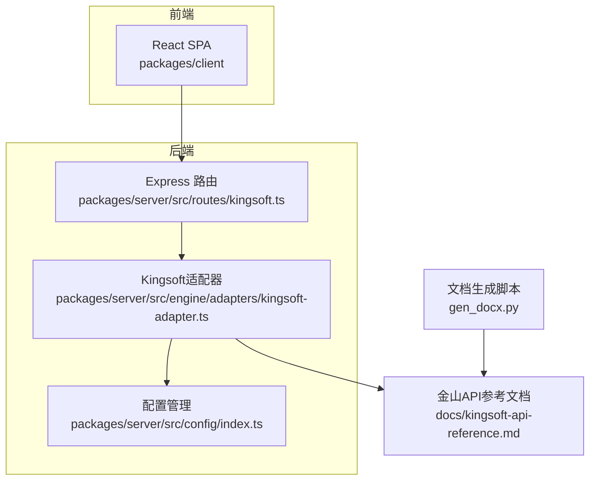
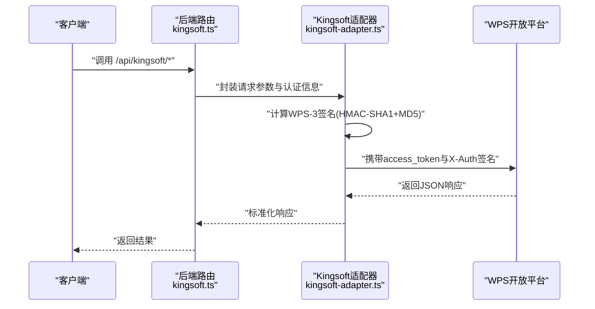
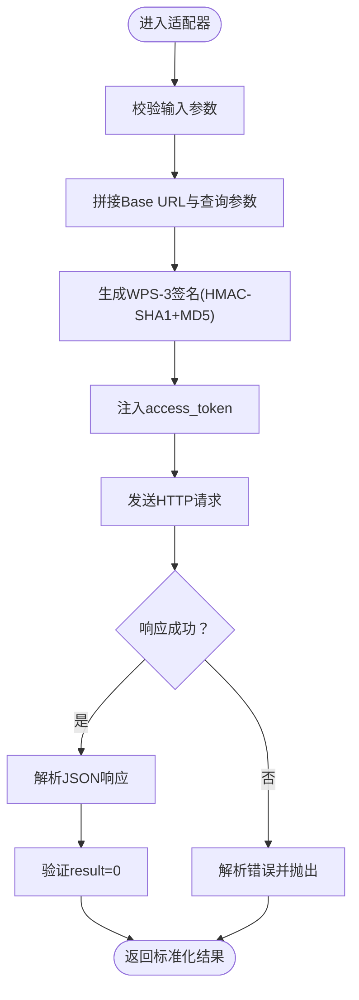
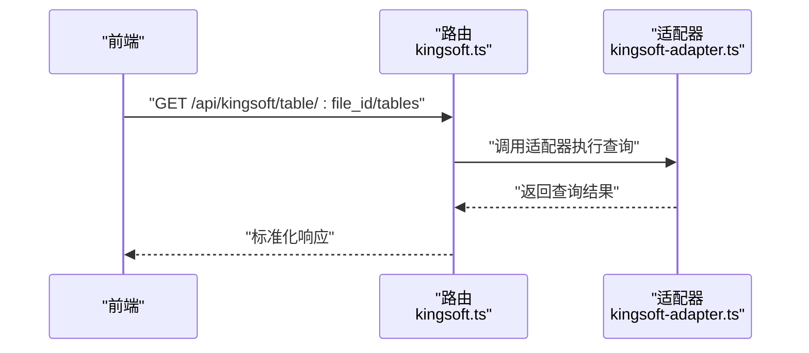
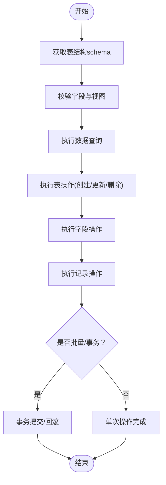
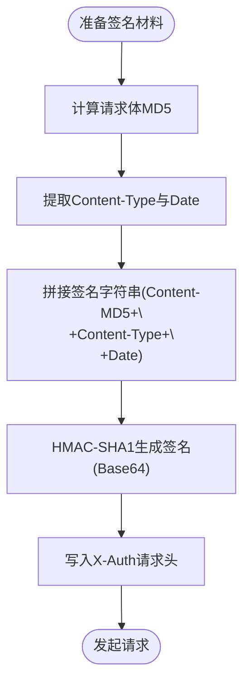
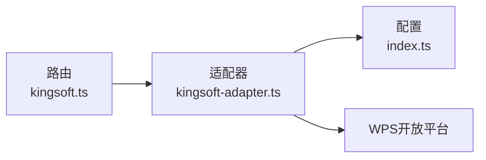

# 金山API集成

<cite>
**本文引用的文件**
- [kingsoft-api-reference.md](file://docs/kingsoft-api-reference.md)
- [kingsoft-adapter.ts](file://packages/server/src/engine/adapters/kingsoft-adapter.ts)
- [kingsoft.ts](file://packages/server/src/routes/kingsoft.ts)
- [index.ts](file://packages/server/src/config/index.ts)
- [package.json](file://package.json)
- [gen_docx.py](file://gen_docx.py)
</cite>

## 更新摘要
**所做更改**
- 更新了WPS-3签名认证机制，从HMAC-SHA256改为HMAC-SHA1 + MD5组合
- 新增了完整的表操作支持，包括创建表、字段和视图
- 重构了Kingsoft适配器实现，提供更全面的API封装
- 更新了路由设计，支持通用代理和特定查询接口
- 增强了错误处理和响应标准化机制

## 目录
1. [简介](#简介)
2. [项目结构](#项目结构)
3. [核心组件](#核心组件)
4. [架构总览](#架构总览)
5. [详细组件分析](#详细组件分析)
6. [依赖关系分析](#依赖关系分析)
7. [性能考虑](#性能考虑)
8. [故障排除指南](#故障排除指南)
9. [结论](#结论)
10. [附录](#附录)

## 简介
本技术文档围绕WPS Office集成的金山API（WPS多维表格）展开，重点覆盖以下方面：
- WPS-3签名认证机制的实现原理与安全策略（HMAC-SHA1 + MD5）
- Kingsoft适配器的设计架构、请求封装与响应处理
- 表格结构验证、数据查询与完整表操作支持
- 错误处理、重试机制与性能优化策略
- 认证配置、API密钥管理与安全最佳实践
- 调试工具与故障排除指南

该系统采用前后端分离架构：前端React SPA负责交互与引导，后端Node.js/Express提供REST API，外部对接WPS开放平台Open API，并通过Kingsoft适配器统一封装认证、签名与请求转发逻辑。

## 项目结构
项目采用多包结构（packages/client 与 packages/server），并包含文档与生成脚本：
- docs：存放金山API参考文档
- packages/server：后端服务，包含路由与适配器
- packages/client：前端应用
- 其他：构建与文档生成脚本

**图表来源**
- [kingsoft.ts](file://packages/server/src/routes/kingsoft.ts)
- [kingsoft-adapter.ts](file://packages/server/src/engine/adapters/kingsoft-adapter.ts)
- [index.ts](file://packages/server/src/config/index.ts)
- [kingsoft-api-reference.md](file://docs/kingsoft-api-reference.md)
- [gen_docx.py](file://gen_docx.py)

**章节来源**
- [package.json:1-10](file://package.json#L1-L10)

## 核心组件
- Kingsoft适配器：封装WPS-3签名认证、请求参数组装、HTTP调用与响应解析
- 金山API路由：对外暴露统一接口，代理调用适配器，集中处理Token与鉴权
- 配置管理：管理API基础URL、密钥和访问令牌
- 文档与生成脚本：维护API参考与实施方案文档，辅助集成与测试

**章节来源**
- [kingsoft-adapter.ts](file://packages/server/src/engine/adapters/kingsoft-adapter.ts)
- [kingsoft.ts](file://packages/server/src/routes/kingsoft.ts)
- [index.ts](file://packages/server/src/config/index.ts)
- [kingsoft-api-reference.md:1-60](file://docs/kingsoft-api-reference.md#L1-L60)

## 架构总览
系统整体架构如下：
- 前端通过路由跳转到WPS多维表格进行实际操作
- 后端路由接收请求，调用Kingsoft适配器
- 适配器负责构造WPS-3签名（HMAC-SHA1 + MD5），拼接访问令牌与请求参数，向WPS开放平台发起HTTP请求
- 适配器对响应进行解析与标准化，返回给上层

**图表来源**
- [kingsoft.ts](file://packages/server/src/routes/kingsoft.ts)
- [kingsoft-adapter.ts](file://packages/server/src/engine/adapters/kingsoft-adapter.ts)
- [kingsoft-api-reference.md:480-500](file://docs/kingsoft-api-reference.md#L480-L500)

## 详细组件分析

### Kingsoft适配器设计与实现
- 职责边界
  - 统一请求封装：将业务参数转换为WPS开放平台所需的请求格式
  - 认证与签名：生成WPS-3签名（HMAC-SHA1 + MD5），附加至请求头
  - Token管理：从环境变量或配置中读取access_token并注入请求
  - 响应处理：解析JSON响应，处理错误码与业务异常
  - 表操作支持：提供完整的表、字段、视图操作接口
- 关键流程
  - 参数校验与默认值设置
  - 请求URL与查询参数拼接
  - WPS-3签名计算与头部注入（Content-MD5 + Date + X-Auth）
  - 发起HTTP请求并解析响应
  - 异常捕获与错误映射

**图表来源**
- [kingsoft-adapter.ts](file://packages/server/src/engine/adapters/kingsoft-adapter.ts)
- [kingsoft-api-reference.md:480-500](file://docs/kingsoft-api-reference.md#L480-L500)

**章节来源**
- [kingsoft-adapter.ts](file://packages/server/src/engine/adapters/kingsoft-adapter.ts)

### 路由与代理机制
- 路由职责
  - 对外暴露统一API入口，如代理调用、获取表列表、字段与视图等
  - 将前端请求转发至Kingsoft适配器
  - 集中处理跨域、日志与基础鉴权
- 代理模式
  - 通过统一代理接口管理Token与签名，避免前端直接接触敏感信息
  - 统一错误处理与重试策略
  - 支持多种操作类型的动态路由分发

**图表来源**
- [kingsoft.ts](file://packages/server/src/routes/kingsoft.ts)
- [kingsoft-adapter.ts](file://packages/server/src/engine/adapters/kingsoft-adapter.ts)

**章节来源**
- [kingsoft.ts](file://packages/server/src/routes/kingsoft.ts)
- [gen_docx.py:290-300](file://gen_docx.py#L290-L300)

### 表格结构验证、数据查询与完整表操作支持
- 表结构验证
  - 通过schema/query接口获取表结构定义，校验字段存在性与类型
  - 对视图与字段进行缓存，减少重复查询开销
- 数据查询
  - 使用record/list接口按条件检索数据，支持分页与排序
  - 对查询结果进行二次校验，确保数据完整性
- 表操作支持
  - 通过sheet/create、fields/create等接口执行建表、建字段等操作
  - 支持视图创建、字段更新、记录增删改查等完整操作集
  - 批量操作时采用事务化处理，失败回滚

**图表来源**
- [kingsoft-api-reference.md:480-500](file://docs/kingsoft-api-reference.md#L480-L500)

**章节来源**
- [kingsoft-api-reference.md:1-60](file://docs/kingsoft-api-reference.md#L1-L60)

### WPS-3签名认证机制与安全策略
- 签名生成
  - 基于请求体MD5、Content-Type和Date生成签名字符串
  - 使用API密钥进行HMAC-SHA1签名
  - 将Base64编码的签名放入请求头X-Auth
- 安全策略
  - access_token仅在后端持有，不透传至前端
  - 签名必须包含Content-MD5、Date和X-Auth头
  - 对敏感操作增加白名单与权限控制
  - 日志脱敏，避免泄露签名与令牌

**图表来源**
- [kingsoft-api-reference.md:480-500](file://docs/kingsoft-api-reference.md#L480-L500)

**章节来源**
- [kingsoft-api-reference.md:480-500](file://docs/kingsoft-api-reference.md#L480-L500)

## 依赖关系分析
- 组件耦合
  - 路由与适配器通过明确接口解耦，便于扩展与替换
  - 适配器与WPS开放平台通过文档约定的API契约耦合
  - 配置模块为适配器提供统一的环境变量管理
- 外部依赖
  - WPS开放平台：核心外部服务
  - 前后端框架：Express、React等
- 循环依赖
  - 当前结构未见循环依赖迹象，保持清晰的单向依赖链

**图表来源**
- [kingsoft.ts](file://packages/server/src/routes/kingsoft.ts)
- [kingsoft-adapter.ts](file://packages/server/src/engine/adapters/kingsoft-adapter.ts)
- [index.ts](file://packages/server/src/config/index.ts)

**章节来源**
- [kingsoft.ts](file://packages/server/src/routes/kingsoft.ts)
- [kingsoft-adapter.ts](file://packages/server/src/engine/adapters/kingsoft-adapter.ts)
- [index.ts](file://packages/server/src/config/index.ts)

## 性能考虑
- 缓存策略
  - 表结构与字段定义缓存，降低重复查询成本
  - 查询结果短期缓存，命中率高的场景显著降压
- 并发与限流
  - 对WPS开放平台请求进行并发限制，避免触发限流
  - 使用队列与背压机制平滑突发流量
- 序列化与网络
  - 合理压缩请求体，减少带宽占用
  - 合理设置超时与重试间隔，平衡可靠性与延迟
- 监控与可观测性
  - 记录关键指标：请求耗时、错误率、重试次数
  - 结合分布式追踪定位瓶颈

## 故障排除指南
- 常见问题
  - 认证失败：检查access_token是否过期或无效；确认签名算法与密钥一致
  - 签名错误：核对请求体MD5、Content-Type、Date和X-Auth头
  - 接口限流：降低并发或增加退避重试
  - 响应异常：检查返回状态码与错误消息，必要时开启详细日志
- 调试建议
  - 使用抓包工具对比请求头与签名
  - 在本地模拟相同参数与时间戳，复现问题
  - 分阶段验证：先验证签名，再验证Token，最后验证业务参数
- 工具与脚本
  - 文档生成脚本可用于快速输出实施方案与接口清单，辅助联调

**章节来源**
- [kingsoft-api-reference.md:480-500](file://docs/kingsoft-api-reference.md#L480-L500)
- [gen_docx.py:290-300](file://gen_docx.py#L290-L300)

## 结论
本方案通过"路由代理 + Kingsoft适配器"的架构，实现了对WPS开放平台的统一接入与安全管控。WPS-3签名与Token管理确保了请求的真实性与机密性；通过缓存、限流与可观测性手段提升系统稳定性与性能。结合本文提供的流程、策略与排障建议，可高效完成WPS Office集成并保障生产可用性。

## 附录
- API参考与示例
  - 参考文档涵盖基础URL、请求头、示例命令等，便于快速集成
- 开发与部署要点
  - 前端负责引导用户在WPS中完成操作，后端负责数据校验与落库
  - 生产环境务必启用HTTPS、最小权限与审计日志
- 配置说明
  - KINGSOFT_API_BASE_URL：API基础URL（可选）
  - KINGSOFT_API_KEY：API密钥（可选）
  - KINGSOFT_API_SECRET：API密钥（必需）

**章节来源**
- [kingsoft-api-reference.md:1-60](file://docs/kingsoft-api-reference.md#L1-L60)
- [gen_docx.py:130-170](file://gen_docx.py#L130-L170)
- [index.ts:17-21](file://packages/server/src/config/index.ts#L17-L21)