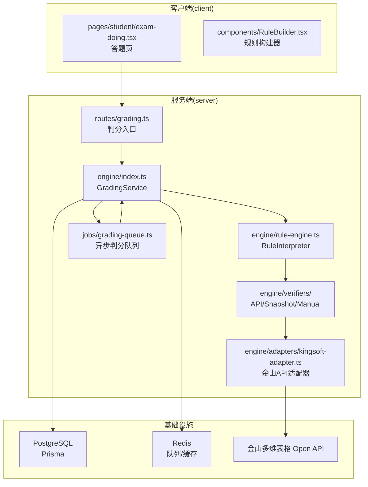
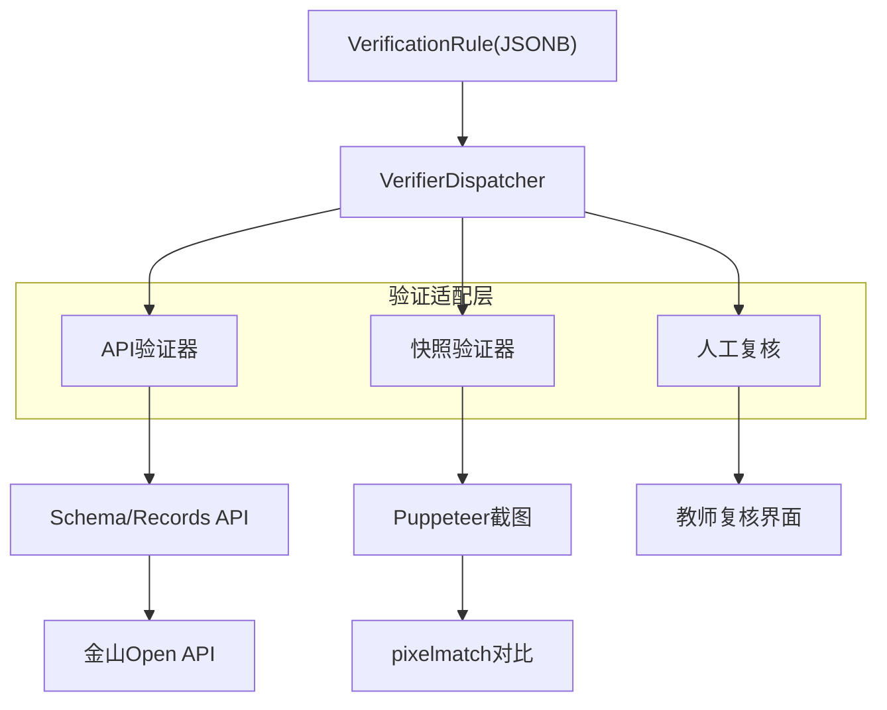
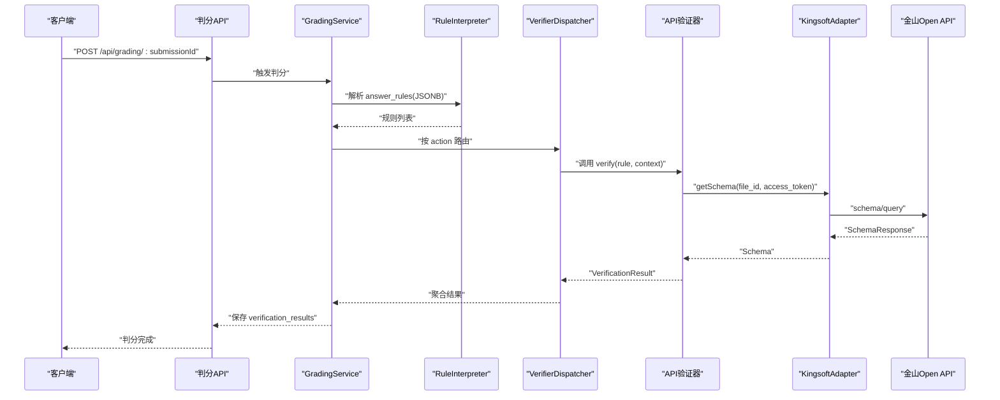
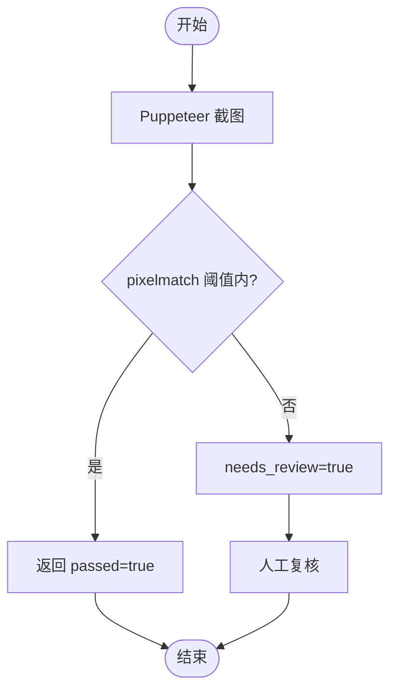
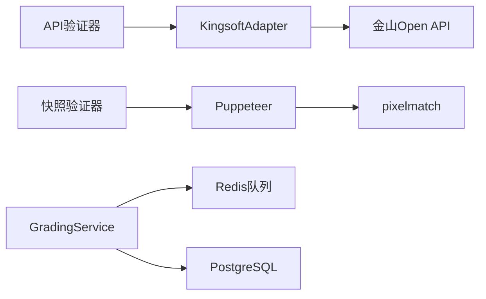

# 验证器实现

<cite>
**本文引用的文件**
- [docker-compose.yml](file://docker-compose.yml)
- [package.json](file://package.json)
- [gen_docx.py](file://gen_docx.py)
- [kingsoft-api-reference.md](file://docs/kingsoft-api-reference.md)
</cite>

## 目录
1. [引言](#引言)
2. [项目结构](#项目结构)
3. [核心组件](#核心组件)
4. [架构总览](#架构总览)
5. [详细组件分析](#详细组件分析)
6. [依赖分析](#依赖分析)
7. [性能考量](#性能考量)
8. [故障排查指南](#故障排查指南)
9. [结论](#结论)
10. [附录](#附录)

## 引言
本文件面向开发者与维护者，系统化阐述考试系统的验证器实现，涵盖18种验证动作的原理、输入输出与执行条件；解释验证器接口设计与扩展机制；提供配置、参数与调试指南，并给出自定义验证器的开发模板与集成方法。验证器体系由“API验证器”“快照验证器”“人工复核机制”构成，统一通过可插拔的验证适配层进行调度。

## 项目结构
- 仓库采用 Monorepo 结构，分为 server 与 client 两个工作区，通过根目录脚本统一管理开发与构建流程。
- 验证引擎位于 server 工程的 engine 子目录，包含规则解释器、验证器分发器与各类验证器实现（API/Snapshot/Manual）。
- 文档与设计说明集中在 docs 目录，其中包含验证引擎设计、API 参考与规则示例。

**图表来源**
- [package.json:17-20](file://package.json#L17-L20)
- [gen_docx.py:514-542](file://gen_docx.py#L514-L542)

**章节来源**
- [package.json:6-16](file://package.json#L6-L16)
- [gen_docx.py:514-542](file://gen_docx.py#L514-L542)

## 核心组件
- 验证引擎总控：GradingService 负责接收判分请求、调度规则解释器与验证器分发器、协调异步队列与数据库持久化。
- 规则解释器：解析题目中的 answer_rules(JSONB)，将规则映射为可执行的验证动作。
- 验证器分发器：根据 rule.action 将规则路由至对应验证器（API/Snapshot/Manual）。
- 验证器接口：统一 IVerifier 接口，要求实现 name 与 verify 方法，verify 返回 VerificationResult。
- 适配器：KingsoftAdapter 封装金山 Open API 的调用、签名与错误处理，提供便捷方法（如 getSchema/getTables/getFields/getViews/getRecords）。
- 队列与持久化：Redis 队列承载异步判分任务，Prisma 写入 verification_results 与 submission_details。

**章节来源**
- [gen_docx.py:306-356](file://gen_docx.py#L306-L356)
- [gen_docx.py:540-561](file://gen_docx.py#L540-L561)

## 架构总览
验证引擎采用“可插拔”的验证适配层，支持三种验证器类型：
- API验证器：基于金山 Open API 的 schema/query 与 record/list 等接口，进行结构与数据的精确/模糊匹配。
- 快照验证器：通过截图对比（Puppeteer + pixelmatch）进行视觉一致性校验，适用于复杂 UI 或公式渲染场景。
- 人工复核：当规则无法自动判定或存在歧义时，标记 needs_review=true，推送教师进行人工复核。

**图表来源**
- [gen_docx.py:158-160](file://gen_docx.py#L158-L160)
- [gen_docx.py:309-313](file://gen_docx.py#L309-L313)

## 详细组件分析

### 验证器接口与结果模型
- IVerifier 接口
  - name: string
  - verify(rule: VerificationRule, context: VerifierContext): Promise<VerificationResult>
- VerificationResult
  - ruleId: string
  - passed: boolean
  - score: number
  - expected: any
  - actual: any
  - errorMessage?: string
  - suggestion?: string
  - needsReview?: boolean
  - verifiedAt?: datetime

上述接口与模型确保了验证器的统一性与可测试性，便于扩展新的验证动作。

**章节来源**
- [gen_docx.py:342-356](file://gen_docx.py#L342-L356)

### 验证动作与执行策略
系统定义了18种验证动作，覆盖表、字段、视图、表单与记录等维度。执行策略遵循“存在性检查→属性检查→模糊匹配→人工兜底”的分层原则。

- 表操作
  - check_table_exists：存在性检查，API 精确匹配表名
  - check_table_name：模糊匹配表名
  - check_table_count：统计表数量
- 字段
  - check_field：字段存在、类型、选项
  - check_field_count：字段数量
  - check_field_required：必填设置
  - check_field_formula：公式字段验证
  - check_linked_record：关联记录字段
- 视图
  - check_view_exists：存在性检查
  - check_view_type：视图类型（grid/kanban/gallery/form/calendar/gantt/query）
  - check_view_filter：筛选条件（需额外接口或 AirScript）
  - check_view_sort：排序规则（需额外接口或 AirScript）
  - check_view_group：看板视图分组字段
- 表单
  - check_form_exists：表单是否存在
  - check_form_fields：表单字段可见性（需额外接口）
  - check_form_settings：表单设置（需额外接口）
- 记录
  - check_record_exists：记录存在
  - check_record_value：记录值（需 record/list）
  - check_record_count：记录数量（需 record/list）

执行条件与输入输出要点
- 输入：VerificationRule.action、params、context（包含 file_id、access_token、table_space_id、schema 缓存等）
- 输出：VerificationResult（passed/score/expected/actual/errorMessage/suggestion/needsReview/verifiedAt）
- 条件：API 验证器依赖金山 Open API 的 schema/query 与 record/list；快照验证器依赖浏览器截图与像素对比；人工复核在无法自动判定时触发。

**章节来源**
- [gen_docx.py:315-339](file://gen_docx.py#L315-L339)
- [kingsoft-api-reference.md:514-539](file://docs/kingsoft-api-reference.md#L514-L539)

### API验证器序列流程

**图表来源**
- [gen_docx.py:309-313](file://gen_docx.py#L309-L313)
- [kingsoft-api-reference.md:540-561](file://docs/kingsoft-api-reference.md#L540-L561)

### 快照验证器流程

**图表来源**
- [gen_docx.py:467](file://gen_docx.py#L467)

### 人工复核机制
- 触发条件：规则无法自动判定、阈值不满足、需要教师主观判断
- 流程：标记 needs_review=true，进入教师复核界面，教师确认后更新 verification_results 并可调整分数
- 与自动判分的衔接：人工复核结果与自动结果共同决定最终得分

**章节来源**
- [gen_docx.py:362](file://gen_docx.py#L362)

### 验证器扩展机制
- 新增验证器步骤
  1) 实现 IVerifier 接口（name + verify）
  2) 在 VerifierDispatcher 中注册该验证器
  3) 在规则中新增对应 action，并在 KingsoftAdapter 或外部系统中实现必要的数据源
  4) 编写单元测试与集成测试
- 参数约定
  - params：验证所需的参数（如 tableName、fieldName、viewType、filters、sorts、groupField 等）
  - context：包含 file_id、access_token、table_space_id、schema 缓存、日志上下文等
- 结果约定
  - passed：布尔值
  - score：本次规则得分（可为0）
  - expected/actual：期望值与实际值，便于审计与复核
  - errorMessage/suggestion：错误与建议，提升可观测性
  - needsReview：是否需要人工复核
  - verifiedAt：验证完成时间戳

**章节来源**
- [gen_docx.py:342-356](file://gen_docx.py#L342-L356)
- [gen_docx.py:315-339](file://gen_docx.py#L315-L339)

### 验证规则示例与最佳实践
- 示例结构
  - JSONB 中的 answer_rules 数组，每项包含 id、action、params、score 等字段
  - 示例：建表、字段、视图、表单、记录等组合规则
- 最佳实践
  - 优先使用存在性检查与属性检查，减少模糊匹配
  - 对公式字段采用正则或编辑距离，保留阈值与建议
  - 对复杂 UI 使用快照验证器，但需控制截图质量与阈值
  - 对无法自动判定的规则标记 needs_review，确保可追溯
  - 将高频 API 调用结果缓存于 Redis，降低延迟与限流风险

**章节来源**
- [gen_docx.py:227-239](file://gen_docx.py#L227-L239)
- [gen_docx.py:357-366](file://gen_docx.py#L357-L366)

## 依赖分析
- 外部依赖
  - 金山 Open API：schema/query、record/list 等接口
  - Puppeteer + pixelmatch：快照验证器
  - Redis：队列与缓存
  - PostgreSQL：持久化验证结果与中间状态
- 内部依赖
  - engine 子模块之间通过接口解耦，VerifierDispatcher 作为中心路由
  - KingsoftAdapter 作为 API 层抽象，隔离外部变更

**图表来源**
- [gen_docx.py:540-561](file://gen_docx.py#L540-L561)
- [docker-compose.yml:4-32](file://docker-compose.yml#L4-L32)

**章节来源**
- [docker-compose.yml:1-37](file://docker-compose.yml#L1-L37)

## 性能考量
- 异步判分：通过 Redis 队列异步执行，避免同步阻塞
- 缓存策略：对 schema 与常用查询结果进行缓存，减少 API 调用次数
- 并发控制：对金山 API 设置合理的并发上限与指数退避重试
- 快照验证：控制截图分辨率与对比阈值，平衡精度与性能
- 数据库写入：批量写入 verification_results，减少事务开销

[本节为通用性能指导，无需特定文件引用]

## 故障排查指南
- API 鉴权失败
  - 现象：401 access_token 过期或无效
  - 处理：刷新 token 或提示学生重新授权
- 资源不存在
  - 现象：404 file_id 无效
  - 处理：检查表格链接与权限
- 速率限制
  - 现象：429 频率限制
  - 处理：指数退避重试，降低并发
- 规则误判
  - 现象：自动判分与预期不符
  - 处理：调整阈值、增加规则或标记 needs_review
- 快照不一致
  - 现象：pixelmatch 阈值外
  - 处理：提高阈值、优化截图质量、人工复核

**章节来源**
- [kingsoft-api-reference.md:556-560](file://docs/kingsoft-api-reference.md#L556-L560)

## 结论
本验证器体系通过统一接口与可插拔架构，实现了对多维表格操作的自动化验证。结合 API 验证、快照验证与人工复核，既能保证判分效率，又能兼顾准确性与可追溯性。建议在实际落地中持续完善规则集、优化缓存与并发策略，并加强可观测性与容错处理。

[本节为总结性内容，无需特定文件引用]

## 附录

### 验证器开发模板与集成方法
- 开发模板
  - 实现 IVerifier 接口，命名清晰，verify 中处理参数校验、调用数据源、构造 VerificationResult
  - 在 VerifierDispatcher 中注册新验证器，确保 action 与实现一一对应
  - 编写单元测试与集成测试，覆盖正常、异常与边界场景
- 集成方法
  - 在题目规则中新增对应 action 与 params
  - 如需外部数据源，扩展 KingsoftAdapter 或新增适配器
  - 将验证结果写入 verification_results，必要时推送人工复核

**章节来源**
- [gen_docx.py:342-356](file://gen_docx.py#L342-L356)
- [gen_docx.py:315-339](file://gen_docx.py#L315-L339)

### 配置与参数设置
- 环境变量与容器
  - 使用 docker-compose 启动 PostgreSQL 与 Redis，确保端口映射与健康检查
- 验证器参数
  - params：根据 action 传入具体参数（如表名、字段名、视图类型、筛选/排序/分组配置等）
  - context：包含 file_id、access_token、table_space_id、schema 缓存等
- 调试方法
  - 开启日志，记录规则执行链路与关键中间态
  - 使用断点与单元测试定位问题
  - 对快照验证器，输出截图与差异图辅助定位

**章节来源**
- [docker-compose.yml:1-37](file://docker-compose.yml#L1-L37)
- [gen_docx.py:357-366](file://gen_docx.py#L357-L366)