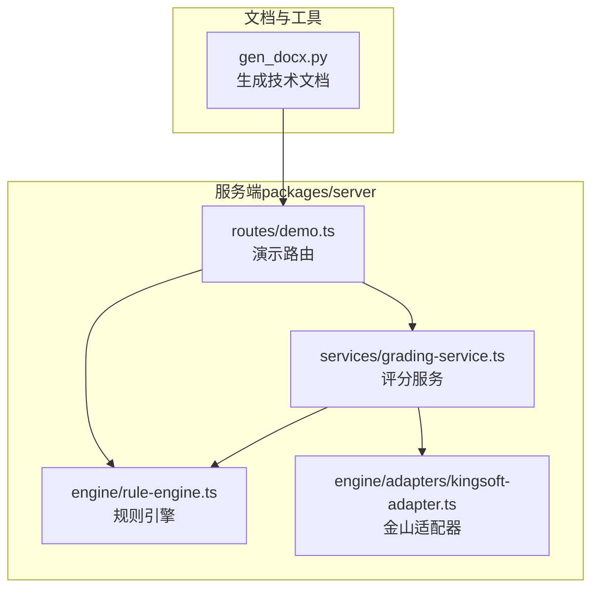
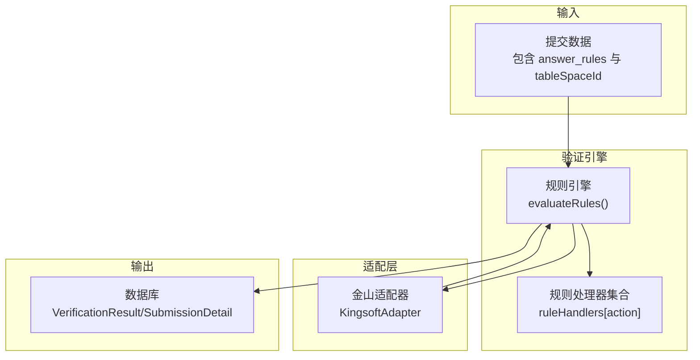
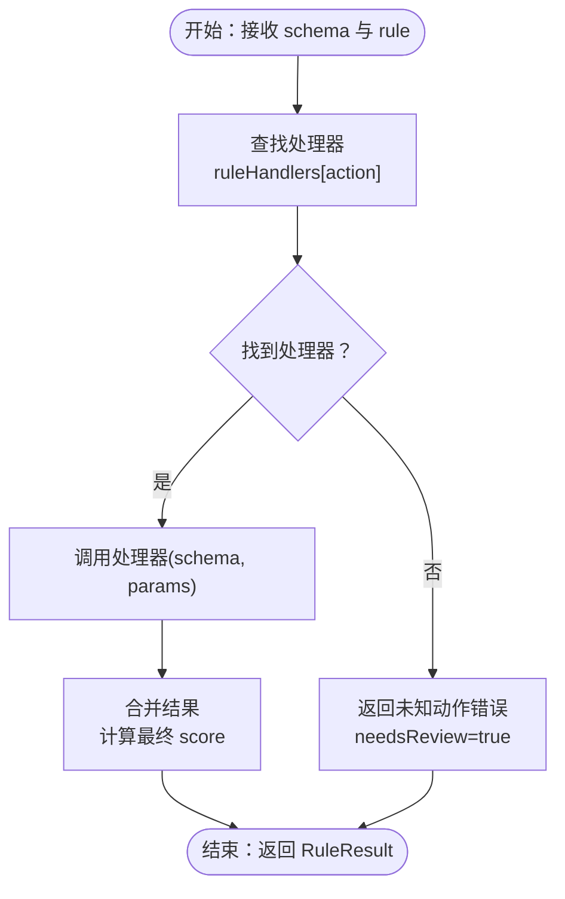
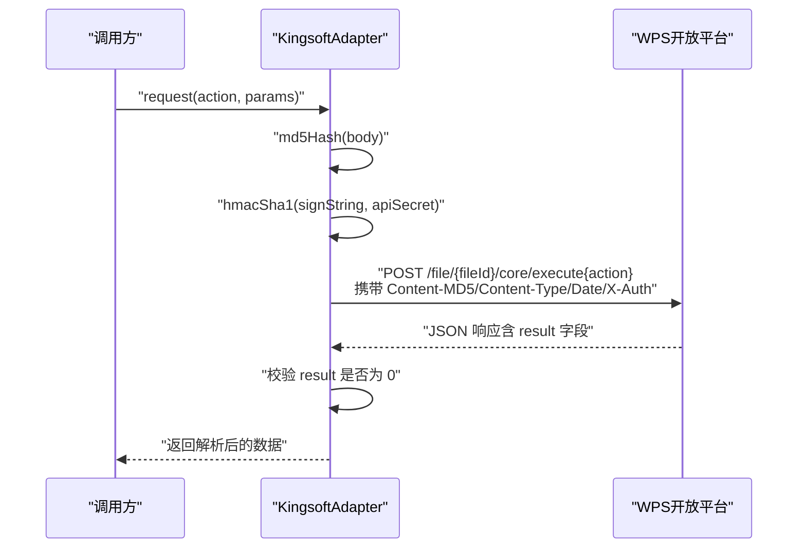
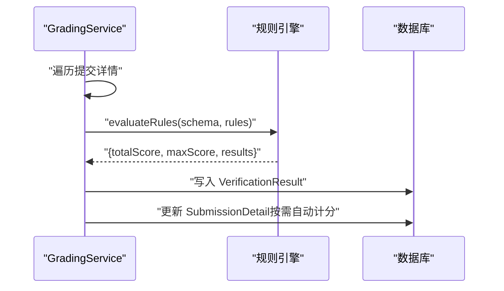
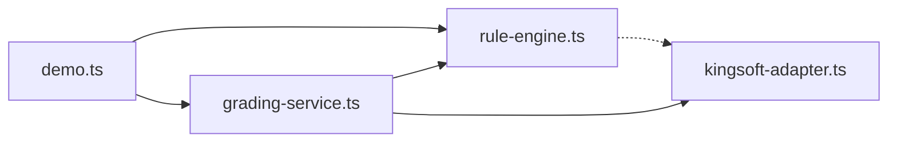

# 验证引擎

<cite>
**本文引用的文件**
- [gen_docx.py](file://gen_docx.py)
- [rule-engine.ts](file://packages/server/src/engine/rule-engine.ts)
- [kingsoft-adapter.ts](file://packages/server/src/engine/adapters/kingsoft-adapter.ts)
- [grading-service.ts](file://packages/server/src/services/grading-service.ts)
- [demo.ts](file://packages/server/src/routes/demo.ts)
</cite>

## 目录
1. [引言](#引言)
2. [项目结构](#项目结构)
3. [核心组件](#核心组件)
4. [架构总览](#架构总览)
5. [详细组件分析](#详细组件分析)
6. [依赖关系分析](#依赖关系分析)
7. [性能考虑](#性能考虑)
8. [故障排除指南](#故障排除指南)
9. [结论](#结论)
10. [附录](#附录)

## 引言
本文件面向开发者与系统维护者，系统化阐述验证引擎的设计与实现，覆盖以下关键主题：
- 18种验证动作的分类、职责与适用场景
- 规则引擎的架构、解析与执行流程
- 金山API适配器的实现原理与WPS-3签名认证机制
- 验证规则的构建方法、调试技巧与性能优化策略
- 实际验证规则示例与故障排除指南
- 扩展验证器接口与自定义验证逻辑的实践指南

## 项目结构
该项目采用前后端分离的包管理方式，核心验证逻辑集中在后端服务中，文档生成工具用于输出规范化的技术文档。

图表来源
- [gen_docx.py](file://gen_docx.py)
- [demo.ts](file://packages/server/src/routes/demo.ts)
- [rule-engine.ts](file://packages/server/src/engine/rule-engine.ts)
- [kingsoft-adapter.ts](file://packages/server/src/engine/adapters/kingsoft-adapter.ts)
- [grading-service.ts](file://packages/server/src/services/grading-service.ts)

章节来源
- [gen_docx.py](file://gen_docx.py)
- [demo.ts](file://packages/server/src/routes/demo.ts)

## 核心组件
- 规则引擎（Rule Interpreter）：负责解析题目中的 answer_rules JSONB，并逐条执行对应的验证动作，产出每条规则的判定结果与分数。
- 金山适配器（Kingsoft Adapter）：封装对WPS开放平台REST API的调用，内置WPS-3签名认证，负责拉取WPS多维表格Schema与记录数据。
- 评分服务（Grading Service）：统一调度规则引擎，聚合结果并写入数据库；对需要人工复核的规则不自动计分，等待人工审核后补分。
- 演示路由（Demo Router）：提供无认证的Mock Schema端点，便于本地联调与演示。

章节来源
- [rule-engine.ts](file://packages/server/src/engine/rule-engine.ts)
- [kingsoft-adapter.ts](file://packages/server/src/engine/adapters/kingsoft-adapter.ts)
- [grading-service.ts](file://packages/server/src/services/grading-service.ts)
- [demo.ts](file://packages/server/src/routes/demo.ts)

## 架构总览
验证引擎采用“规则驱动 + 可插拔验证器”的架构。整体流程如下：
- 评分服务根据提交内容获取或构造WPS Schema
- 规则引擎解析answer_rules，按动作类型路由到具体验证器
- 验证器基于Schema或外部API进行判断，返回通过状态、分数、期望/实际值及是否需要人工复核
- 评分服务汇总结果，写入数据库并更新题目得分

图表来源
- [rule-engine.ts](file://packages/server/src/engine/rule-engine.ts)
- [kingsoft-adapter.ts](file://packages/server/src/engine/adapters/kingsoft-adapter.ts)
- [grading-service.ts](file://packages/server/src/services/grading-service.ts)

## 详细组件分析

### 规则引擎（Rule Interpreter）
- 职责
  - 解析题目中的 answer_rules JSONB
  - 根据 action 分派到对应处理器
  - 产出每条规则的判定结果（通过/失败/需复核）、分数、期望与实际值
- 关键类型
  - AnswerRule：包含 id、action、params、score
  - RuleResult：包含 ruleId、action、passed、score、maxScore、expected、actual、errorMessage、needsReview
  - SchemaResponse：WPS多维表格Schema（sheets/fields/views等）
- 处理流程
  - 依据 action 查找 ruleHandlers 中的处理函数
  - 若找不到处理器，返回未知动作错误并标记为需人工复核
  - 合并处理器返回的判定信息，按规则是否通过决定最终得分
- 特殊说明
  - 部分动作（如记录值、记录数量）因无法仅凭Schema判断，会返回需人工复核的结果

图表来源
- [rule-engine.ts](file://packages/server/src/engine/rule-engine.ts)

章节来源
- [rule-engine.ts](file://packages/server/src/engine/rule-engine.ts)

### 金山适配器（Kingsoft Adapter）
- 职责
  - 封装对WPS开放平台REST API的调用
  - 实现WPS-3签名认证（HMAC-SHA1 + MD5），确保请求安全
- 关键能力
  - 构造请求头：Content-MD5、Content-Type、Date、X-Auth（签名）
  - 统一封装HTTP请求与响应校验（result=0表示成功）
  - 工厂方法：从 tableSpaceId 解析出适配器实例（支持fileId:accessToken[:apiSecret]格式）
- WPS-3签名机制
  - 步骤
    1) 计算请求体的MD5（十六进制小写）
    2) 拼接签名字符串：Content-MD5 + "\n" + Content-Type + "\n" + Date
    3) 使用API密钥对签名字符串做HMAC-SHA1，再Base64编码
    4) 将签名放入请求头 X-Auth
  - 安全要点
    - 严格遵循时间戳UTC格式（Date）
    - Content-MD5必须与请求体一致
    - Content-Type固定为application/json

图表来源
- [kingsoft-adapter.ts](file://packages/server/src/engine/adapters/kingsoft-adapter.ts)

章节来源
- [kingsoft-adapter.ts](file://packages/server/src/engine/adapters/kingsoft-adapter.ts)

### 评分服务（Grading Service）
- 职责
  - 统一调度规则引擎，聚合每题的验证结果
  - 将每条规则的判定写入 VerificationResult
  - 对需要人工复核的规则不自动计分，等待人工审核后补分
  - 更新 SubmissionDetail 的分数与正确性标记
- 关键逻辑
  - 读取每题的 answer_rules 并调用 evaluateRules
  - 统计需复核的数量，决定是否自动计分
  - 自动得分仅包含 passed 且 needsReview=false 的规则

图表来源
- [grading-service.ts](file://packages/server/src/services/grading-service.ts)

章节来源
- [grading-service.ts](file://packages/server/src/services/grading-service.ts)

### 演示路由（Demo Router）
- 职责
  - 提供无认证的Mock Schema端点，便于本地联调与演示
  - 保留原有功能，不影响正式环境的认证与数据流
- 使用建议
  - 在开发阶段使用该端点快速验证规则与流程
  - 正式部署时请替换为真实Schema来源

章节来源
- [demo.ts](file://packages/server/src/routes/demo.ts)

## 依赖关系分析
- 规则引擎依赖于WPS Schema（来自适配器或Mock）
- 评分服务依赖规则引擎与数据库
- 金山适配器依赖配置（API基础URL、访问令牌、API密钥）

图表来源
- [demo.ts](file://packages/server/src/routes/demo.ts)
- [rule-engine.ts](file://packages/server/src/engine/rule-engine.ts)
- [kingsoft-adapter.ts](file://packages/server/src/engine/adapters/kingsoft-adapter.ts)
- [grading-service.ts](file://packages/server/src/services/grading-service.ts)

章节来源
- [demo.ts](file://packages/server/src/routes/demo.ts)
- [rule-engine.ts](file://packages/server/src/engine/rule-engine.ts)
- [kingsoft-adapter.ts](file://packages/server/src/engine/adapters/kingsoft-adapter.ts)
- [grading-service.ts](file://packages/server/src/services/grading-service.ts)

## 性能考虑
- 规则解析与执行
  - 规则引擎为纯函数，避免I/O与网络请求，具备良好的可测试性与性能稳定性
  - 建议在上层缓存Schema，减少重复拉取
- API调用
  - 金山适配器每次请求均进行签名与哈希计算，建议批量请求与合理并发控制
  - 对频繁查询的端点，可在业务层增加本地缓存与失效策略
- 数据写入
  - 评分服务一次性批量写入VerificationResult，降低数据库压力
  - 建议在高并发场景下对SubmissionDetail更新加锁或使用事务

## 故障排除指南
- 未知规则类型
  - 现象：规则被判定为未知动作，needsReview=true
  - 处理：检查 answer_rules 中 action 是否在规则处理器集合中注册
  - 参考路径：[rule-engine.ts](file://packages/server/src/engine/rule-engine.ts)
- API请求失败
  - 现象：适配器抛出API请求失败异常
  - 处理：检查fileId、accessToken、apiSecret是否正确；确认网络连通性；查看响应状态码与消息
  - 参考路径：[kingsoft-adapter.ts](file://packages/server/src/engine/adapters/kingsoft-adapter.ts)
- WPS-3签名错误
  - 现象：请求头Content-MD5、Content-Type、Date或X-Auth不匹配导致认证失败
  - 处理：确保请求体MD5与签名字符串拼接顺序正确；Date使用UTC字符串；secret正确
  - 参考路径：[kingsoft-adapter.ts](file://packages/server/src/engine/adapters/kingsoft-adapter.ts)
- 需人工复核的规则
  - 现象：某些动作（如记录值、记录数量）返回needsReview=true
  - 处理：通过人工复核补齐分数；或扩展验证器以支持远程查询
  - 参考路径：[rule-engine.ts](file://packages/server/src/engine/rule-engine.ts)
- 自动计分异常
  - 现象：题目得分未自动更新
  - 处理：确认所有规则均通过且无needsReview；检查数据库写入是否成功
  - 参考路径：[grading-service.ts](file://packages/server/src/services/grading-service.ts)

章节来源
- [rule-engine.ts](file://packages/server/src/engine/rule-engine.ts)
- [kingsoft-adapter.ts](file://packages/server/src/engine/adapters/kingsoft-adapter.ts)
- [grading-service.ts](file://packages/server/src/services/grading-service.ts)

## 结论
验证引擎通过“规则驱动 + 可插拔验证器 + 金山适配器”的架构，实现了对WPS多维表格的自动化判分与人工复核的协同。规则引擎纯函数化设计保证了可测试性与性能；WPS-3签名机制保障了API调用的安全性；评分服务统一调度与结果落库，形成闭环。对于复杂业务场景，可通过扩展验证器接口与自定义规则来满足多样化需求。

## 附录

### 验证动作清单与应用场景
- 表操作
  - check_table_exists：验证表是否存在
  - check_table_name：验证表名（支持模糊匹配）
  - check_table_count：验证表数量
- 字段
  - check_field：验证字段存在、类型、选项
  - check_field_count：验证字段数量
  - check_field_required：验证必填设置
  - check_field_formula：验证公式字段
  - check_linked_record：验证关联记录
- 视图
  - check_view_exists：验证视图是否存在
  - check_view_type：验证视图类型（grid/kanban/gallery/form/…）
  - check_view_filter：验证筛选条件
  - check_view_sort：验证排序规则
  - check_view_group：验证分组字段
- 表单
  - check_form_exists：验证表单是否存在
  - check_form_fields：验证表单字段可见性
  - check_form_settings：验证表单设置
- 记录
  - check_record_exists：验证记录存在
  - check_record_value：验证记录值（需人工复核）
  - check_record_count：验证记录数量（需人工复核）

章节来源
- [gen_docx.py](file://gen_docx.py)

### 验证规则构建方法
- 规则结构
  - id：规则唯一标识
  - action：动作类型（见上表）
  - params：动作参数对象
  - score：该规则满分
- 示例参考
  - 规则示例（JSONB结构）：[gen_docx.py](file://gen_docx.py)
- 构建建议
  - 先易后难：优先覆盖基础表/字段/视图规则
  - 明确边界：对需要远程查询的动作标注为需人工复核
  - 可测试性：尽量使用Mock Schema进行单元测试

章节来源
- [gen_docx.py](file://gen_docx.py)

### 调试技巧
- 使用演示路由获取Mock Schema，快速验证规则
  - 参考路径：[demo.ts](file://packages/server/src/routes/demo.ts)
- 在规则引擎中打印每条规则的处理结果，定位失败原因
  - 参考路径：[rule-engine.ts](file://packages/server/src/engine/rule-engine.ts)
- 对API调用进行日志记录，捕获签名与响应细节
  - 参考路径：[kingsoft-adapter.ts](file://packages/server/src/engine/adapters/kingsoft-adapter.ts)

章节来源
- [demo.ts](file://packages/server/src/routes/demo.ts)
- [rule-engine.ts](file://packages/server/src/engine/rule-engine.ts)
- [kingsoft-adapter.ts](file://packages/server/src/engine/adapters/kingsoft-adapter.ts)

### 性能优化策略
- 缓存Schema：减少重复拉取WPS Schema
- 批量写入：评分服务一次性写入VerificationResult
- 并发控制：限制适配器并发请求，避免触发限流
- 规则预编译：对高频规则进行预处理与索引优化

### 扩展验证器接口与自定义逻辑指南
- 验证器接口（概念）
  - name：验证器名称
  - verify(rule, context): Promise<VerificationResult>
- 扩展步骤
  - 在规则处理器集合中新增对应 action 的处理函数
  - 如需远程查询，通过适配器调用WPS API并解析结果
  - 对无法仅凭Schema判断的动作，返回 needsReview=true
- 注意事项
  - 保持返回结构一致（passed/score/expected/actual/errorMessage/needsReview）
  - 对外部API调用做好错误处理与重试策略

章节来源
- [rule-engine.ts](file://packages/server/src/engine/rule-engine.ts)
- [kingsoft-adapter.ts](file://packages/server/src/engine/adapters/kingsoft-adapter.ts)