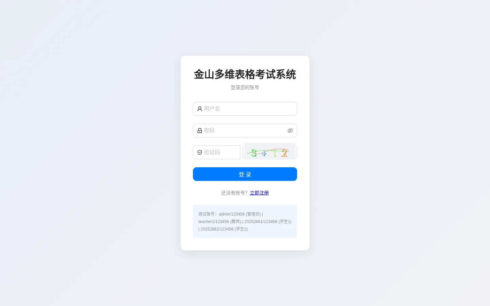
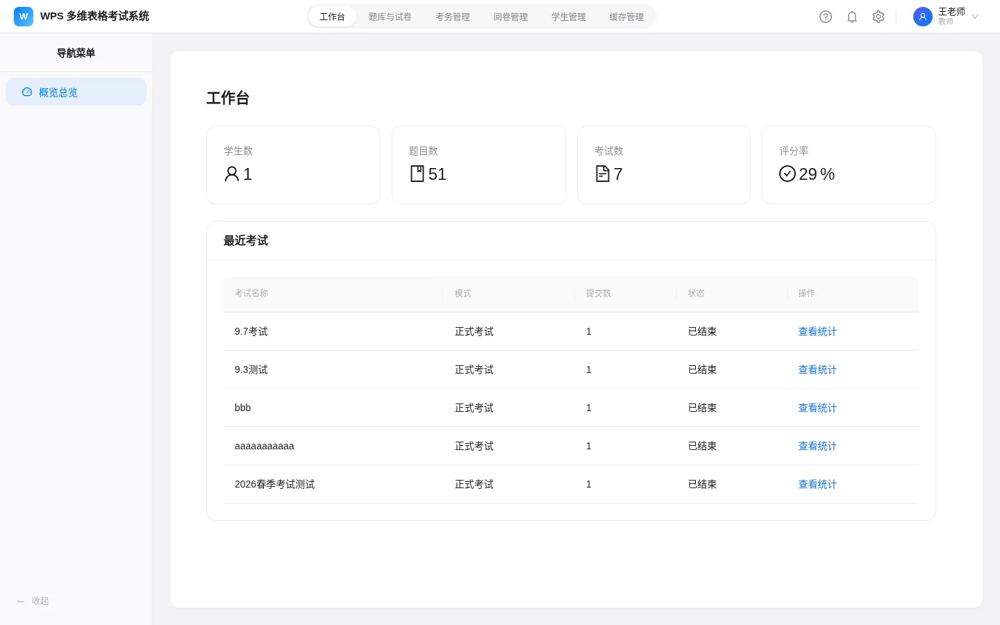
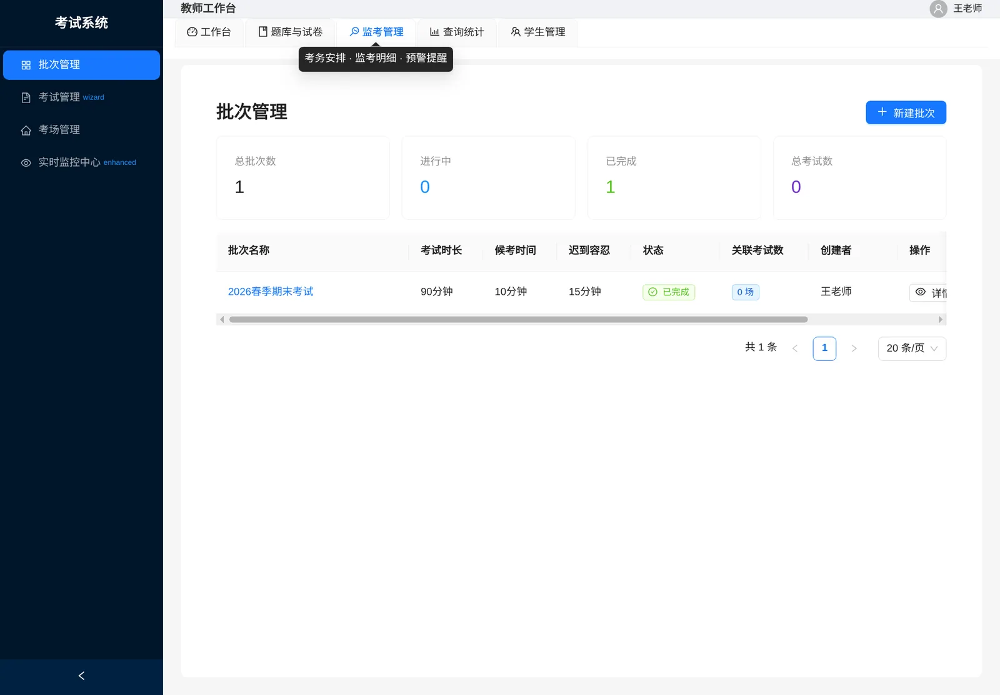
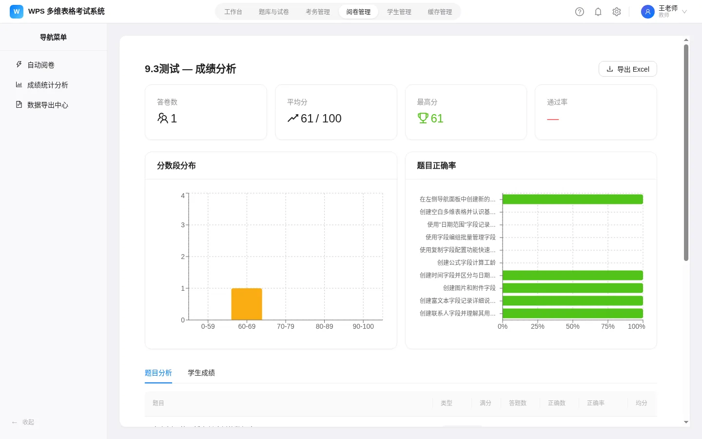
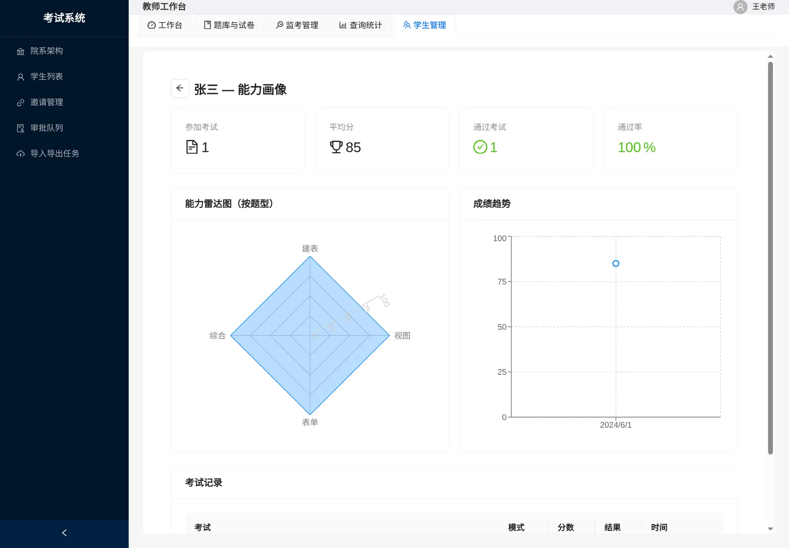
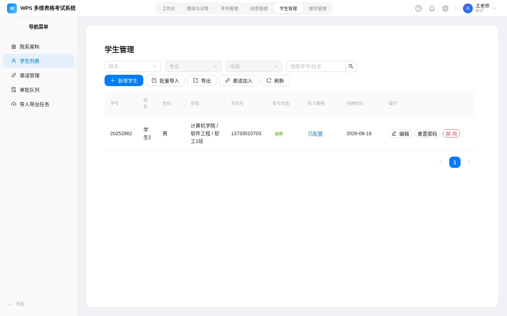
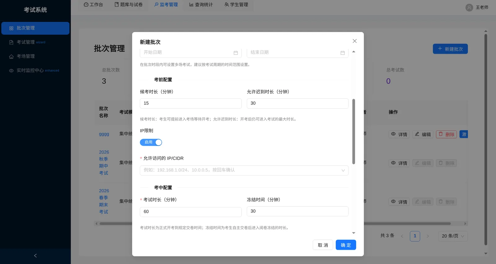
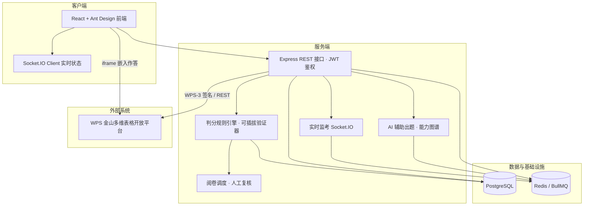

<div align="center">

# WPS 多维表格考试系统

**操作即作答，表格结构即答案**

一套基于 WPS 多维表格的在线**实操**考试平台 —— 让考生在真实表格中动手操作，由规则引擎读取表格结构自动判分。


[核心特性](#-核心特性) ·
[系统架构](#-系统架构) ·
[快速开始](#-快速开始) ·
[目录结构](#-目录结构) ·
[文档](#-文档索引)

</div>

---

## 📖 项目简介

传统在线考试只能考"选择题和填空"，而办公软件、数据处理这类**动手能力**始终难以客观考核。本项目把考核介质换成真实的 WPS 多维表格：

> 教师为每道题配置结构化**判分规则**（如"是否存在名为「学生档案」的数据表""字段「入学日期」是否为日期类型且必填"）→ 考生在网页内嵌的多维表格中按要求操作 → 交卷后系统读取表格 **Schema**，由规则引擎逐条比对自动判分 → 无法自动判定的检查点标记为**待复核**，交由教师人工补分。

一句话：**把考生的动手结果变成机器可读的"答卷"，用规则引擎替代老师完成大量机械核对。**

- 🎯 **实操考核**：作答介质是真实软件，杜绝"纸上谈兵"
- ⚙️ **自动判分**：结构化规则 + 二十余种可插拔验证器，纯函数、易测试、易扩展
- 🛡️ **公平内建**：全屏守护 / 切屏检测 / 心跳上报 / IP 白名单 / 自动交卷
- 🔁 **学习闭环**：交卷即出分、逐题解析、错题本、能力图谱与 AI 辅助出题

---

## 📸 效果预览

| 登录页 | 教师工作台 |
| :---: | :---: |
|  |  |

| 批次管理 | 成绩统计与分析 |
| :---: | :---: |
|  |  |

| 学生档案 | 学生管理 | IP 白名单 |
| :---: | :---: | :---: |
|  |  |  |

---

## ✨ 核心特性

### 🎓 学生端

- **在线实操作答**：左侧题目区 + 右侧 WPS 多维表格嵌入区，支持答题卡跳题、倒计时警示、到点自动交卷
- **入场三步**：考前环境检测（浏览器全屏 / 网络 / 系统资源）→ 身份核验 → 强制阅读考场规则
- **即时反馈**：交卷即出分，提供总分、通过情况、逐题得分与**检查点级明细**
- **自主练习**：按分类 / 难度抽题练习，提交即出分并附解析，错题自动进入错题本

### 👩‍🏫 教师端

- **题库与试卷**：5 类多维表格操作题型（创建表格 / 添加字段 / 配置视图 / 创建表单 / 综合操作），判分规则可视化配置与预览，试卷组装与复制
- **考务编排**：批次（草稿 → 上线 → 完成 → 归档，级联发布）+ 五步考试向导；支持**集中统一**与**随到随考**两种时间模式
- **实时监考**：Socket.IO 监控中心展示在线 / 离线、切屏次数、异常预警，按考场分组并支持导出 Excel
- **阅卷与成绩**：自动阅卷 + 人工复核，逐题调整、查看原始结构数据，成绩统计与分布报表
- **AI 辅助出题**：基于 66 项能力点上下文，SSE 流式生成题目完善建议并一键应用

### 🛠️ 管理员端

- 用户 / 角色 / 班级管理，"院系 → 专业 → 班级"三级组织树
- 学生批量导入（Excel 模板）、班级邀请链接 + 入班审批
- LLM Provider / API Key / 温度与限流参数配置

### 🔐 安全与可靠性

- JWT 鉴权 + 角色权限与数据归属隔离（"创建者归属 + 角色守卫 + 组织树"三重约束）
- Helmet 安全响应头、express-rate-limit 限流、bcrypt 密码哈希、图形验证码
- WPS 凭据由服务端持有并掩码显示，前端不接触敏感凭据
- BullMQ 异步化判分与导入导出，Redis 缓存热点数据与 Schema

---

## 🏗️ 系统架构

前后端分离 + Monorepo（npm workspaces），分为表现层 / 业务逻辑层 / 数据访问层：



**关键链路**

| 链路 | 流程 |
| --- | --- |
| 考试生命周期 | 草稿 → 发布（批次级联）→ 进行中（实时监控）→ 收卷 / 结束 → 阅卷 → 成绩 |
| 判分链路 | 交卷入队（异步）→ 读取考生表格 Schema → 规则引擎逐题逐规则比对 → 结果批量落库 → 待复核项进入人工阅卷 |
| 监考链路 | 考生端心跳与切屏 / 全屏事件 → Socket.IO 推送 → 预警规则判定 → 教师端实时告警 |

---

## 🧰 技术栈

| 层次 | 技术选型 |
| --- | --- |
| 前端 | React 18 · Ant Design 6 · React Router · Zustand · Axios · Socket.IO Client · Vite 5 · Recharts |
| 后端 | Node.js · Express 4 · TypeScript · Prisma ORM · Zod · jsonwebtoken · bcryptjs · Socket.IO · ioredis + BullMQ |
| 数据 / 缓存 | PostgreSQL 15 · Redis 7 |
| 安全 | Helmet · express-rate-limit · svg-captcha · JWT 鉴权与角色中间件 |
| 办公文件 | exceljs / xlsx（学生批量导入、答卷与成绩导出） |
| AI | OpenAI 兼容接口，Provider 可切换（deepseek / qwen / glm / sensenova / ollama），SSE 流式输出 |
| 工程化 | npm workspaces · tsx · Vitest · Docker 多阶段构建 · Prisma migrate / seed |

---

## 🚀 快速开始

### 前置要求

- **Node.js ≥ 18**（推荐 20 LTS）与 npm（支持 workspaces）
- **PostgreSQL 15** 与 **Redis 7**（可本机安装，也可用下方 Docker Compose 一键拉起）
- 可选：**Docker** 与 Docker Compose（容器化部署）

### 1. 克隆与安装

```bash
git clone https://github.com/Ren-chao02/wps_dbsheet_examination_system.git
cd wps_dbsheet_examination_system
npm install
```

### 2. 配置环境变量

```bash
cp .env.example .env
```

按需填写以下变量（详见 [.env.example](.env.example)）：

| 变量 | 说明 |
| --- | --- |
| `DATABASE_URL` | PostgreSQL 连接串 |
| `REDIS_URL` | Redis 连接串 |
| `JWT_SECRET` / `JWT_EXPIRES_IN` | 鉴权密钥与有效期 |
| `KINGSOFT_API_KEY` / `KINGSOFT_API_SECRET` | WPS 开放平台应用凭据（可稍后在管理页配置） |
| `LLM_PROVIDER` / `LLM_API_KEY` / `LLM_MODEL` 等 | AI 辅助出题所用大模型（OpenAI 兼容端点） |

> ⚠️ 生产环境务必替换默认 `JWT_SECRET`，切勿使用弱密钥。

### 3. 初始化数据库

```bash
npm run db:migrate   # 执行 Prisma 迁移
npm run db:seed      # 写入种子数据（含多维表格样例题库）
```

### 4. 启动开发环境

```bash
npm run dev
```

并行启动后端（`tsx watch`，端口 **3002**）与前端（Vite，端口 **5173**）。

| 服务 | 地址 |
| --- | --- |
| 前端 | http://localhost:5173 |
| 后端 API | http://localhost:3002/api/health |

### 5. Docker 一键部署（可选）

```bash
npm run docker:up    # 等价于 docker compose up -d
```

编排 `postgres` / `redis` / `app` 三个容器：应用端口 3002 与数据库、缓存均**仅绑定 `127.0.0.1`**，容器入口脚本会自动执行迁移、种子与启动。

```bash
npm run docker:down  # 停止并移除容器
```

### 常用脚本

| 命令 | 说明 |
| --- | --- |
| `npm run dev` | 并行启动前后端开发服务 |
| `npm run build` | 依次构建后端与前端 |
| `npm run db:migrate` | Prisma 迁移 |
| `npm run db:seed` | 写入种子数据 |
| `npm run db:studio` | 打开 Prisma Studio |
| `npm run docker:up` / `docker:down` | 容器编排启停 |

---

## 📁 目录结构

```
.
├── packages/
│   ├── client/                     # 前端（React + Vite）
│   │   └── src/
│   │       ├── pages/student/      # 我的考试 / 入场 / 答题 / 结果 / 练习 / 成绩
│   │       ├── pages/teacher/      # 题库试卷 / 考务向导 / 实时监控 / 阅卷 / 学生管理
│   │       ├── pages/admin/        # 用户 / 角色 / 缓存管理
│   │       ├── components/exam/    # 全屏守护 / 答题卡 / 答题组件
│   │       └── components/wps/     # WPS 集成相关组件
│   └── server/                     # 后端（Express + Prisma）
│       ├── src/
│       │   ├── routes/             # REST 路由（认证/题库/考试/考场/答卷/阅卷/审计…）
│       │   ├── engine/             # 判分规则引擎与验证器（核心）
│       │   ├── jobs/               # BullMQ 异步队列（批量阅卷等）
│       │   ├── coaching/           # AI 辅助出题（上下文构建 / 提案 / 工具调用）
│       │   ├── data/capabilities/  # 能力域 / 能力点模型
│       │   └── middleware/         # 鉴权与统一错误处理
│       └── prisma/                 # 数据库 Schema、迁移与种子数据
├── assets/screenshots/             # README 演示截图
├── docker-compose.yml              # PostgreSQL / Redis / App 编排
├── Dockerfile                      # 应用多阶段构建镜像
└── package.json                    # Monorepo 根配置与统一脚本
```

---

## 🧪 测试

使用 [Vitest](https://vitest.dev/) 进行单元测试，覆盖判分引擎、答案还原 / 提案逻辑、SSE 流式解析、AI 提案应用等核心模块：

```bash
npm test -w packages/server
npm test -w packages/client
```

---

## 📚 文档索引

| 文档 | 内容 |
| --- | --- |
| [使用说明书.md](使用说明书.md) | 面向教师 / 学生的完整功能使用说明 |
| [参赛项目详细介绍.md](参赛项目详细介绍.md) | 作品定位、需求分析、系统设计与实现要点 |
| `packages/client/public/help/` | 站内帮助文档（系统使用说明书、WPS Token 获取引导） |

---

## 🗺️ 路线图

- [ ] 扩展更多题型与判分规则，覆盖记录级数据校验场景
- [ ] 智能组卷与成绩大数据分析（班级 / 知识点维度画像）
- [ ] 基于能力诊断自动生成个性化练习包
- [ ] 题库共建共享与多校复用
- [ ] 判分引擎服务化拆分，支撑更高并发

---

## 🤝 贡献

欢迎提交 Issue 与 Pull Request。

1. Fork 本仓库并创建特性分支：`git checkout -b feature/your-feature`
2. 提交前请确保类型检查与单测通过：`npm run build && npm test -w packages/server`
3. 提交遵循 [Conventional Commits](https://www.conventionalcommits.org/)（如 `feat(exam): ...`、`fix(engine): ...`）
4. 发起 Pull Request，说明改动动机与验证方式

---

## 📄 许可证

本项目基于 [MIT License](LICENSE) 开源。

Copyright (c) 2026 Ren-chao02

---

<div align="center">

**如果这个项目对你有帮助，欢迎点一个 ⭐ Star**

</div>