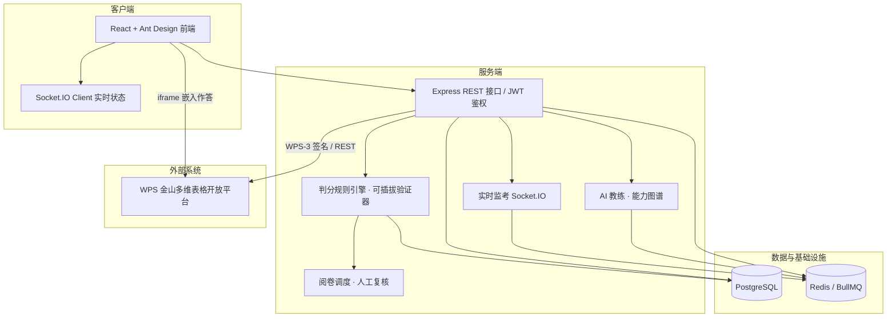
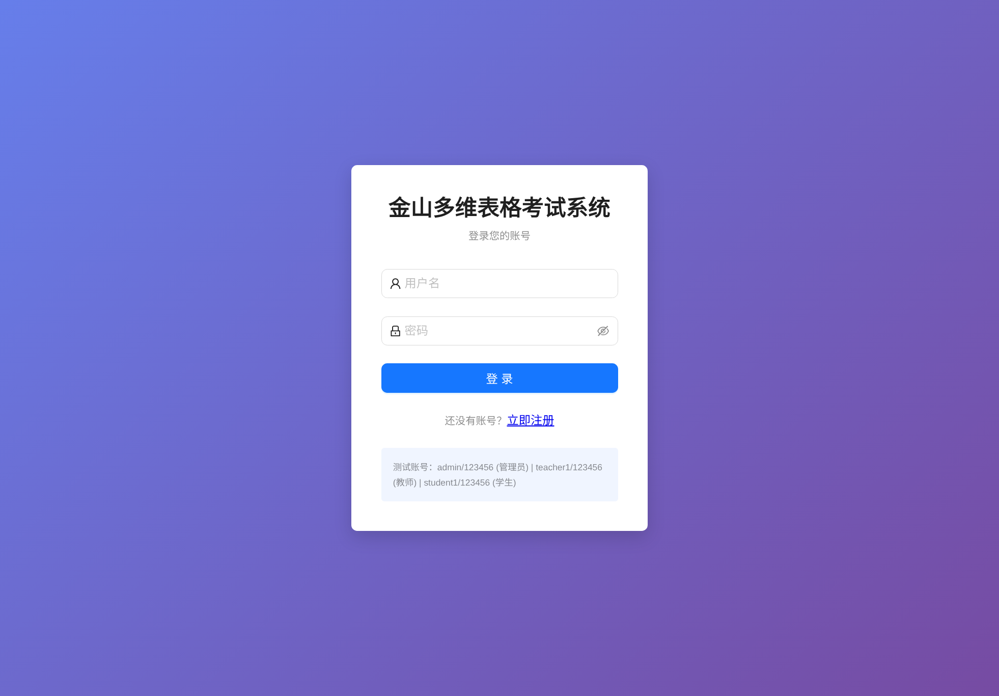
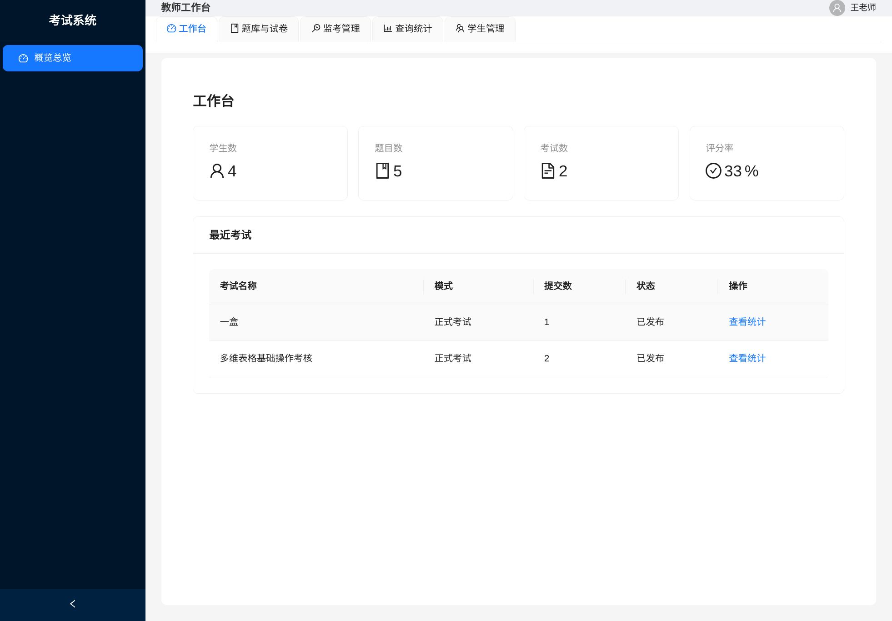
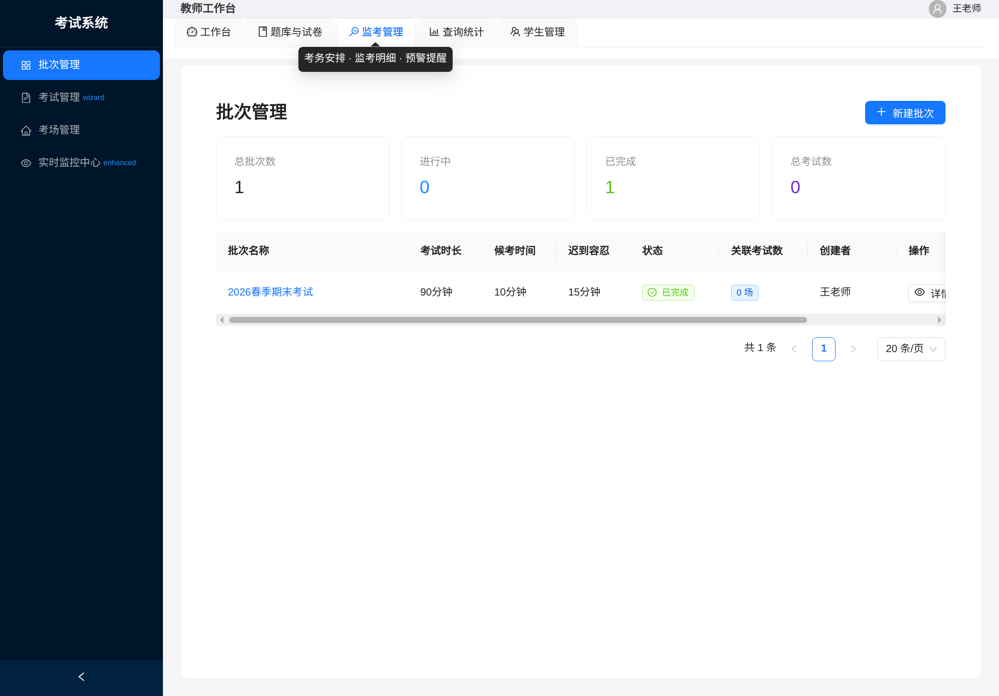
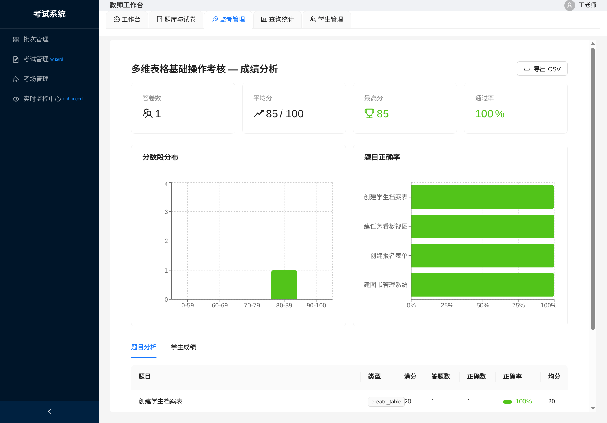
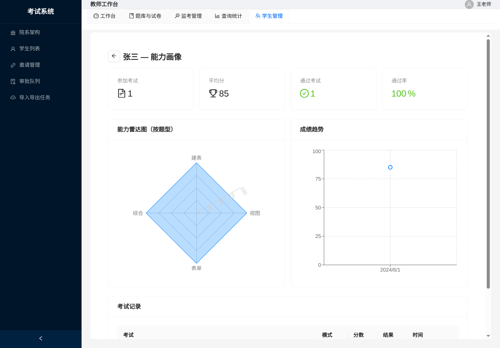

# 让"实操"被真实地考核 —— 基于 WPS 多维表格的在线实操考试系统

> **参赛作品详细介绍（以参赛团队成员第一人称撰写）**
> 项目名：金山多维表格考试系统（WPS 多维表格在线实操考试平台）
> 仓库目录：`examination-system`（Monorepo：`packages/client` + `packages/server`）
> 说明：本文可作为比赛申报书、作品说明书与答辩 PPT 的内容底稿，文中截图使用仓库内已有截图相对路径，可随时替换为最新界面。

---

## 0. 作品基本信息（请按比赛要求补充）

| 项目 | 内容 |
|---|---|
| 作品名称 | 金山多维表格考试系统——WPS 多维表格在线实操考试平台 |
| 参赛赛道/类别 | （填写，如：软件应用与开发 / 教育信息化应用） |
| 团队名称 / 成员 | （填写） |
| 指导老师 | （填写） |
| 一句话亮点 | 考生在真实 WPS 多维表格中动手作答，系统读取表格结构自动判分，实现"真操作、自动判、可监考、能练习"的实操考核闭环 |
| 演示方式 | Web 端在线演示（另附演示账号与录屏） |

---

## 1. 项目背景：我们为什么要做它

数字办公已经深度融入课堂与职场，**表格软件（尤其 WPS 多维表格这类新形态工具）的实操能力**成为高校计算机公共课、职业院校技能课、企业培训与认证中的常见考核内容。然而我们在课程与竞赛实践中发现，现有的考核方式存在三个难以回避的问题：

1. **考不出真实水平**：传统纸笔考试、选择题只能考察"是否记住步骤"，无法判断"是否真的会做"。学生背得住操作顺序，却可能从未在真实软件里完成过一次完整操作。
2. **阅卷难、标准不一**：实操考核如果采用人工阅卷，教师需要逐份打开学生做好的表格核对，几十上百份批改下来费时费力，且不同老师对同一份答卷的判断容易不一致，引发争议。
3. **在线考试公平性难保障**：一旦把考试搬到线上，切屏查资料、他人代做、超时未交等作弊与失控风险随之而来，普通平台缺少有效的监考与防作弊手段。

因此我们决定**自己动手开发一套"实操型"在线考试系统**：让学生在真实的 WPS 多维表格中完成操作作为作答，由系统自动读取操作结果并判分，同时提供完整的监考、防作弊、练习与教学闭环。这个选题既贴近真实教学需求，又包含扎实的技术难点（开放平台集成、自动判分引擎、实时监考、权限体系等），非常适合作为参赛作品进行展示与迭代。

---

## 2. 作品简介与核心机制

本系统是一套**基于 WPS/金山多维表格的在线实操考试平台**，面向学校、培训机构与企业培训场景，用于考核考生的表格实操能力。

与传统考试的本质区别在于它的核心机制——**"操作即作答，表格结构即答案"**：

1. 教师出题时，为每道题配置结构化**判分规则**（如"是否存在名为 X 的数据表""字段 Y 是否为日期类型且必填""视图 Z 是否设置了某筛选条件"等）；
2. 考生登录后进入专属的考试页面，在网页内嵌的真实 WPS 多维表格中按要求完成操作；
3. 交卷后，系统通过 WPS 开放平台读取考生表格的**结构信息（Schema）**，由后端规则引擎逐条比对判分，自动计分并生成逐题、逐检查点的判分明细；
4. 无法自动判断的检查点会被标记为"待复核"，由教师在阅卷页面人工确认后补分，形成"自动为主、人工兜底"的阅卷闭环。

一句话概括：**把考生的动手结果变成机器可读的"答卷"，用规则引擎代替老师完成大量机械核对工作。**

---

## 3. 需求分析

### 3.1 用户角色与核心诉求

| 角色 | 主要诉求 |
|---|---|
| 学生 | 参加真实操作考试；考试过程公平规范；交卷后快速看到成绩、每题得分与原因；平时可自由练习、自动收集错题 |
| 教师 | 便捷维护题库/试卷；灵活组织大规模考试（统一考、随到随考）；实时掌握考场动态、处理异常；自动阅卷 + 人工复核；成绩统计 |
| 管理员 | 账号与角色权限管理、班级组织管理、系统配置维护 |

### 3.2 功能需求总览

| 模块 | 主要功能 |
|---|---|
| 身份与组织 | 学生/教师/管理员三类角色、图形验证码登录注册；"院系→专业→班级"三级组织树；学生批量导入（Excel 模板）、班级邀请链接 + 入班审批；账号启停 |
| 题库与试卷 | 5 类多维表格操作题型（创建表格 / 添加字段 / 配置视图 / 创建表单 / 综合操作）；题目难度、分类、操作提示；判分规则的可视化配置与预览；试卷组装、复制 |
| 考务编排 | 批次（草稿→上线→完成→归档，级联发布/延期/下线）；考试五步向导（信息→试卷→场次→考场→考生分配，草稿自动保存）；集中统一 / 随到随考两种时间模式；候考、迟到容忍、IP 白名单、续考策略等规则配置 |
| 在线作答 | 考前环境检测（浏览器全屏支持、网络、系统资源）；入场三步（核验身份→强制阅读考场规则→开始作答）；左侧题目区 + 右侧 WPS 多维表格嵌入区答题，支持"新标签页打开"兜底；答题卡跳题、倒计时警示、到点自动交卷 |
| 防作弊与监考 | 全屏守护（屏蔽 F11/ESC、退出全屏记违规）、切屏检测计数、10~30 秒心跳上报；Socket.IO 实时监控中心（在线/离线、切屏次数、异常预警、按考场分组、导出 Excel） |
| 判分与成绩 | 自动阅卷 + 人工复核（逐题调整、查看原始结构数据）；判分点级明细（表存在、字段检查、视图筛选等，未通过项标"待复核"）；成绩统计与分布报表 |
| 学习闭环 | 按分类/难度自主抽题练习、提交即出分、每题解析、错题本；通知中心；AI 教练与能力图谱（详见 4.2） |

### 3.3 非功能需求

- **安全**：JWT 鉴权、角色权限与数据归属隔离、服务端安全响应头与限流、密码哈希、WPS 凭据服务端持有与掩码显示；
- **可靠**：断网可续考、心跳与自动收卷兜底、操作审计日志；
- **性能**：Redis 缓存热点数据、BullMQ 异步化判分与导入导出任务、批量写入、Schema 缓存；
- **可维护可扩展**：前后端分离 + Monorepo 工作区、模块化路由、纯函数化规则引擎、单元测试覆盖；
- **可部署**：Docker Compose 一键编排 PostgreSQL / Redis / 应用，环境变量化配置。

---

## 4. 设计理念与主要创新点

### 4.1 设计理念

1. **真实操作即答案**：把考核介质放在真实软件中，把"评判对象"定义为表格结构，使开放式实操可以被客观自动地判定，杜绝"纸上谈兵"。
2. **自动为主、人工兜底**：能用结构比对的自动判分，无法仅凭结构判断的（如记录数值是否正确）交给教师复核，兼顾效率与严谨。
3. **公平内建、而非事后补救**：全屏守护、切屏检测、心跳、IP 白名单、自动交卷等措施与考试流程融为一体，使成绩可信、可追溯。
4. **从"考一次"到"学会它"**：交卷即出分、逐题解析、错题本、AI 教练建议，让考试成为学习的一部分。

### 4.2 主要创新点

- **N1 自动判分范式创新**：以"考生表格的 Schema 结构"作为答卷载体，通过结构化规则自动核对"表 / 字段 / 视图 / 表单 / 记录"五类对象，将"阅卷"变成可计算、可复现的规则执行。
- **N2 规则驱动 + 可插拔验证器**：判分规则以结构化 JSON 存于题目中，规则引擎按动作类型分发到内置的二十余种验证处理器，验证器为纯函数、易测试、易扩展；无法判定的返回"待复核"，由人工补分。
- **N3 深度集成 WPS 开放平台**：网页内嵌真实多维表格作为作答环境；服务端适配层统一封装开放平台 REST API，实现 WPS-3 请求签名鉴权；access_token 由服务端统一管理与在线刷新，前端不接触敏感凭据；另提供 Mock 数据端点，便于开发与演示。
- **N4 全链路防作弊与实时监考**：从"考前环境检测"到"考中全屏守护/切屏记录/心跳"再到"考后行为可查"，结合 Socket.IO 实时监控中心与可配置预警规则，形成完整在线监考能力。
- **N5 面向真实教务的考务编排**：批次级联发布、多场次、考场与座位、随到随考等设计，满足单场数十人到跨班多场次考试的组织需求。
- **N6 "测—评—练—辅"学习闭环**：系统沉淀了 **6 大能力域、66 项能力点**（表操作、字段类型、字段属性、视图配置、表单、记录操作）的知识体系，并以此为基础提供自主练习、错题本与 **AI 教练**（对话式个性化建议），把考试系统升级为技能学习平台。
- **N7 完备的组织与权限模型**：三级组织树、邀请审批自助入班、资源"创建者归属"与角色隔离，普通教师只能管理自己的题目/试卷/考试，管理员可统筹全局。

---

## 5. 系统总体设计

### 5.1 总体架构

系统采用**前后端分离 + Monorepo（npm workspaces）**架构，分三层设计：

- **表现层**：React 单页应用（多角色布局、路由守卫、状态管理、Axios 统一封装）；
- **业务逻辑层**：Node.js/Express 服务（认证与权限中间件、业务路由、判分引擎、实时通信、外部集成适配）；
- **数据访问层**：PostgreSQL（Prisma ORM）持久化，Redis 承担缓存与消息队列。



### 5.2 核心模块划分

| 目录/模块 | 职责 |
|---|---|
| `packages/client` | 学生端、教师端、管理员端界面；答题器、全屏守护、答题卡、实时监控、阅卷、AI 教练面板等 |
| `packages/server/src/routes` | 认证、用户、题库试卷、批次考试、考场、答卷、自动阅卷、审计、缓存/令牌等 REST 路由 |
| `packages/server/src/engine` | 判分规则引擎与验证器、Schema 处理等核心判分逻辑 |
| `packages/server/src/jobs` | BullMQ 异步队列（如批量阅卷任务） |
| `packages/server/src/coaching` | AI 教练：能力点上下文构建、提案生成、模型工具调用 |
| `packages/server/src/data/capabilities` | 能力域/能力点数据模型（字段、表单、记录、表、视图） |
| `packages/server/prisma` | 数据库 Schema、迁移与种子数据（含多维表格题库样例） |
| 根目录脚本 / Docker | 一键开发、构建、迁移、编排（见附录 A） |

### 5.3 核心数据实体（概要）

围绕**用户（三类角色与组织归属）、题库（题目 + 结构化判分规则）、试卷、批次 / 考试 / 场次 / 考场（含座位）、考生分配、答卷（含状态机：待考/考试中/已提交/评分中/已评分）、判分明细（逐规则结果）、通知、审计日志**等实体建模，通过 Prisma 管理表结构、索引与关系，保证一致性。

### 5.4 关键业务链路

- **考试生命周期**：草稿 → 发布（含批次级联发布）→ 进行中（实时监控）→ 收卷/结束 → 阅卷 → 成绩。
- **判分链路**：交卷入队（异步）→ 读取/构造考生表格 Schema → 规则引擎逐题逐规则比对 → 结果批量落库 → 需复核项进入人工阅卷 → 确认后出分。
- **监考链路**：考生端定时心跳与切屏/全屏事件 → Socket.IO 推送到监控中心 → 预警规则判定 → 教师端实时告警与干预。

---

## 6. 技术实现方法（含代码术语）

### 6.1 技术栈

| 层次 | 技术选型 |
|---|---|
| 前端 | React 18、Ant Design、React Router、Zustand、Axios、Socket.IO Client、Vite、Recharts |
| 后端 | Node.js + Express、TypeScript、Prisma ORM、Zod、jsonwebtoken、bcryptjs、Socket.IO、ioredis + BullMQ |
| 数据/缓存 | PostgreSQL 15、Redis 7（Docker Compose 编排，仅绑定回环） |
| 安全 | Helmet、express-rate-limit、svg-captcha、JWT 鉴权与角色中间件 |
| 办公文件 | exceljs / xlsx（学生批量导入、答卷与成绩导出） |
| AI 教练 | OpenAI 兼容接口，provider 可切换（deepseek / qwen / glm / sensenova / ollama），SSE 流式输出 |
| 工程化 | npm workspaces、tsx、Vitest（单元测试）、Docker 多阶段构建、Prisma migrate/seed |

### 6.2 前端实现要点

- 按角色划分布局与私有路由，未授权自动重定向；Zustand 管理登录态并持久化；
- Axios 实例统一注入 `Authorization`，401 自动清理并回登录页；
- 答题页实现"题目区 + 内嵌多维表格区"左右布局，支持答题卡跳题、进度与倒计时、交卷二次确认；
- 全屏守护组件屏蔽退出全屏快捷键，切屏通过 visibilitychange / blur 事件计数并上报；
- 考试向导支持分步表单与草稿自动保存（localStorage 24h 恢复）；
- 实时监控中心基于 Socket.IO 订阅学生状态，按"总览 / 考场 / 异常预警"分组展示并支持 Excel 导出。

### 6.3 后端实现要点

- Express 分层路由 + 统一错误处理；JWT 中间件解析并注入用户，按角色授权；所有入参经 Zod 校验；
- Prisma 统一数据访问；Redis 用于热点缓存与 BullMQ 队列，判分与批量导入导出异步执行；
- 判分引擎：题目携带 `answer_rules`（JSONB），引擎按 `action` 查表分发到注册的验证器集合，返回 `passed / score / expected / actual / needsReview` 等结构化结果，纯函数设计、单测覆盖；
- WPS 集成适配：服务端实现 WPS-3 签名（Content-MD5 + Date + X-Auth 头），封装 Schema 读取等 REST 调用；access_token 提供"在线刷新 / 手动回填 / 掩码显示 / 有效期提示"的集中管理，令牌持久化于服务端供教师共享；提供无鉴权 Mock Schema 端点便于联调与演示。

### 6.4 AI 教练（二期能力）

基于能力图谱（66 项能力点）与考生答题数据构建上下文，调用 OpenAI 兼容大模型生成**个性化提分提案**（如针对薄弱能力点的练习建议、操作讲解），前端以 SSE 流式渲染；教师端可配置模型 Provider、API Key、温度与限流参数。

---

## 7. 开发与测试中的难点及解决方案（答辩素材）

| 难点 | 我们遇到的真实问题 | 解决方案 |
|---|---|---|
| 开放式操作如何客观判分 | 学生操作千差万别，"做了表但名字不同"该如何给分 | 放弃"内容比对"，改为**读取表格结构 Schema 做规则判定**；支持模糊匹配、字段/视图等多层级检查 |
| 自动判不了的情况 | 记录内容、数量等无法仅凭结构判断 | 引入 **needsReview（待复核）机制**，自动阅卷只给确定分，剩余由教师人工复核补分，保证严谨 |
| 在线考试公平性 | 切屏、退出全屏、代考难以察觉 | 环境检测 + 全屏守护 + 切屏计数 + 心跳 + IP 白名单 + 自动交卷；Socket.IO 监控中心实时预警 |
| 外部依赖不稳定 | WPS access_token 过期导致自动阅卷失败；第三方接口偶发超时 | 提供 Token 集中管理页（在线刷新/手动回填/有效期提醒）；适配层统一错误处理，Schema 结果缓存，降低重复请求 |
| 大规模并发 | 整场考试同时交卷、批量阅卷可能拖垮主进程 | 判分、导入导出等耗时任务放入 **BullMQ 队列异步执行**；判分明细批量落库 |
| 复杂权限与数据隔离 | 教师之间、师生之间的数据边界容易越权 | "创建者归属 + 角色守卫 + 组织树"三重约束；管理员可管全局，普通教师仅能管理本人资源 |
| 真实考场细节问题 | 随到随考/批次时间展示在真实试考中出现边界情况 | 通过真实试考反复验证，补充"批次上线级联发布""迟到不可入场""考试中禁止编辑"等状态机规则 |

---

## 8. 使用说明与演示流程（快速走查）

> 演示账号由作者在答辩/评审材料中单独提供（默认口令不写入本文档）。

### 学生视角（2 分钟走查）

1. 登录 → "我的考试"找到目标考试 → 点击"进入考试"；
2. 依次完成**环境检测 → 身份核对 → 阅读考场规则**；
3. 在答题页左侧读题、右侧 WPS 多维表格中操作，支持答题卡跳题；
4. 交卷 → 查看总分、通过情况、每题得分与检查点明细；错题进入错题本；
5. 平时进入"题库练习"自由刷题，提交即时出分与解析。

### 教师视角（2 分钟走查）

1. 题库管理：新建一道"创建数据表"题并配置判分规则 → 组一份试卷；
2. 考务：创建批次与考试（向导 5 步：信息/试卷/场次/考场/学生分配）→ 发布；
3. 考试中：打开"实时监控中心"查看学生在线状态、切屏次数与预警；
4. 考后：对答卷"自动阅卷"→ 对"待复核"项人工复核 → 查看成绩统计。

### 界面截图（仓库内已有样例，可替换）








---

## 9. 测试与应用效果

### 9.1 质量保障

- **单元测试（Vitest）**：覆盖判分引擎、答案还原/提案等核心逻辑、SSE 流式解析、AI 提案应用等关键模块；
- **真实试考验证**：2026-09-03 完成一场包含 10 道多维表格操作题的真实试考（`9.3测试_分析报告.csv`），系统按题输出逐题/逐检查点判分明细（如"创建空白多维表格并认识基本界面结构"10/10、"使用'日期范围'字段记录项目周期"5/10 等），可支撑教师精准定位薄弱点；
- 通过真实考场排期、批次联动等边界场景的调试（见第 7 节），修复了批次时间显示等问题。

### 9.2 应用效果（预期价值）

- **对教师**：自动阅卷替代大量机械核对，评分规则统一、留痕可查，把精力还给教学；
- **对学生**：操作即考、考完即知分，配合解析、错题本与 AI 教练建议，形成个性化学习闭环；
- **对管理者**：成绩统计、过程监控与审计数据齐备，大规模多场次考试组织有序，考核公信力提升。

---

## 10. 应用场景分析

| 场景 | 说明 |
|---|---|
| 高校课程考核 | 计算机公共课 / 办公软件课程的期末上机考试、随堂测验与补考 |
| 职业技能培训 | 职业院校、培训机构表格技能课程的模拟练习与结业考核 |
| 企业内训与认证 | 新员工入职表格操作测评、技能等级认证、培训结业考核 |
| 技能竞赛 | 办公软件技能竞赛的初赛筛选与决赛评比 |
| 日常练习 | 课后实操作业、随时随地的自主练习与错题复习 |

系统同时支持**集中统一考试**（固定时间统一开考）与**随到随考**（开放时段内随进随考、各自计时），适配机房、家庭与培训室等多种环境。

---

## 11. 与同类产品的客观比较

| 对比维度 | 通用在线考试平台 | 本系统 |
|---|---|---|
| 作答介质 | 选择题/文本输入 | 真实 WPS 多维表格内实操作答 |
| 判分方式 | 客观题自动、主观题人工 | 结构规则自动判分 + 待复核人工兜底 |
| 防作弊 | 部分支持防切屏 | 全屏守护 + 切屏/心跳 + IP 白名单 + 实时监考中心 |
| 考核目标 | 知识记忆 | 真实软件操作能力 |
| 学习闭环 | 较少 | 练习、错题本、能力图谱与 AI 教练 |
| 部署方式 | SaaS 居多 | 可私有化 Docker 部署，数据自主可控 |

---

## 12. 总结与展望

我们以"让实操被真实地考核"为目标，从真实教学痛点出发，独立完成了一整套集**题库、考务、实操作答、自动判分、实时监考、成绩与学习闭环**于一体的 WPS 多维表格实操考试系统。开发过程中，我们不仅解决了"开放式操作如何自动判分"这一核心难题，也补全了防作弊、权限隔离、外部平台集成等工程化能力，并通过真实试考验证了系统可用性。

**后续规划**：

- 扩展更多题型与判分规则（覆盖记录级数据校验的更多场景）；
- 智能组卷与成绩大数据分析（班级/知识点维度画像）；
- 基于 AI 教练的能力诊断自动生成个性化练习包；
- 题库共建共享与多校复用；
- 判分引擎服务化拆分，支持更高并发。

我们相信，这套作品既能解决眼前的教学考核难题，也具备继续成长为一款通用"实操技能测评平台"的潜力。恳请评委老师指正，谢谢！

---

## 附录

### A. 运行与部署

```bash
# 本地开发（需 Node.js，仓库已配置 npm workspaces）
npm install
npm run dev            # 并行启动后端(tsx watch)与前端(Vite)

# 数据库准备
npm run db:migrate     # Prisma 迁移
npm run db:seed        # 种子数据（含样例题库）

# 容器化部署（生产镜像见 Dockerfile，入口脚本自动迁移+种子+启动）
docker compose up -d   # 编排 postgres / redis / app（app 端口 3002，仅绑定 127.0.0.1）
```

环境变量通过 `.env` 配置（`.env.example` 提供模板）：数据库与 Redis 连接、JWT 密钥、WPS 开放平台密钥、AI 模型 Provider 与参数。

### B. 相关文档索引

| 文档 | 内容 |
|---|---|
| `使用说明书.md` | 面向教师/学生的完整功能使用说明 |
| `docs/kingsoft-api-reference.md` | WPS 开放平台接入与签名参考 |
| `docs/knowledge-points.md` | 能力图谱（6 大能力域 / 66 项能力点 / 判分规则）梳理 |
| `.qoder/repowiki/zh/content/` | 项目概述、系统架构、验证引擎、数据库设计等仓库维基 |
| `docs/superpowers/` | 需求/设计/实现计划（specs 与 plans） |
| `9.3测试_分析报告.csv` | 真实试考逐题判分明细样例 |

### C. 主要代码目录导读

```
packages/server/src
├── routes/            # REST 路由（认证/用户/题库/试卷/批次/考试/考场/答卷/阅卷/审计/缓存令牌…）
├── engine/            # 判分规则引擎与验证器（核心）
├── jobs/              # BullMQ 异步队列（批量阅卷等）
├── coaching/          # AI 教练（上下文构建/提案/工具）
├── data/capabilities/ # 能力域/能力点模型
├── services/          # 通知等服务
└── middleware/        # 鉴权与统一错误处理

packages/client/src
├── pages/student/     # 我的考试/入场/答题/结果/练习/成绩
├── pages/teacher/     # 题库试卷/考务向导/实时监控/阅卷/学生管理/缓存
├── pages/admin/       # 用户/角色/缓存管理
└── components/exam/   # 全屏守护/答题卡/答题组件
```
